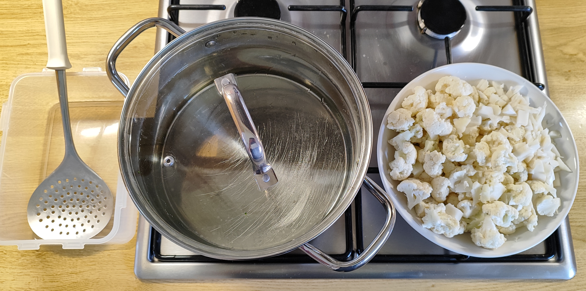

# Kurt kocht - Gemüsevorbereitung Blumenkohl

### Optimale Vorbereitung durch Blanchieren und Einfrieren

* Den Blumenkohl halbieren, putzen und in Röschen zerteilen.
* Den Strunk zerteilen und in dünne Scheiben (Blumenkohl-Chips) schneiden.
* Ausreichend Wasser zum Sieden bringen; dabei kein Salz hinzufügen.
* Den Blumenkohl in das siedende Wasser schütten, untertauchen und ca. 4 Minuten im heißen Wasser lassen.
* Danach entnehmen, in eine Gefrierdose füllen und gut 2 Minuten offen stehen lassen.
* Die Dose verschließen und noch handwarm tiefgefrieren.

---

### Warum 4 Minuten beim Blumenkohl ideal sind

Im Gegensatz zum Brokkoli erfordert die kompakte Zellstruktur des Blumenkohls eine angepasste Strategie, um eine perfekte Textur und einen milden Geschmack zu garantieren.

#### 1. Dichte der Röschen und Kern-Deaktivierung
* Blumenkohl hat eine deutlich kompaktere und festere Zellstruktur als Brokkoli.
* Die längere Zeit ist nötig, um im Kern die Enzyme zu deaktivieren und die Zellwände so weit zu lockern, dass sie nach dem Auftauen angenehm mürbe werden.
* Eine zu kurze Zeit ließe das Innere "roh", was zu einer ungleichmäßigen Textur führen würde.

#### 2. Stärkemodifikation für sanften Biss
* Blumenkohl enthält mehr komplexe Kohlenhydrate, die durch die längere Hitzeeinwirkung leicht modifiziert werden.
* Dies sorgt für den spezifischen, sanften Biss, den wir an gut zubereitetem Blumenkohl schätzen.

#### 3. Geschmacksstabilität
* Blumenkohl neigt bei zu kurzem Blanchieren dazu, nach dem Einfrieren einen herben, "kohligen" Beigeschmack zu entwickeln.
* Die Zeit im kochenden Wasser neutralisiert diese Verbindungen effektiv.

#### 4. Kein Salz im Blanchier-Wasser
* Wie beim Brokkoli verzichten wir auf Salz im Wasser, um die Zellstruktur zu schonen.

---

### Der "Handwarm-Effekt" und die Weiterverarbeitung

* **Der Dampfgar-Effekt:** Das Einfrieren im handwarmen Zustand bewahrt eine minimale Restfeuchte im Behälter.
* **Saftigkeit:** Diese Feuchtigkeit wirkt beim späteren Garen in der Pfanne wie ein kleiner Dampfgar-Effekt, wodurch der Blumenkohl besonders saftig bleibt.
* **Optik:** Der Blumenkohl behält seine appetitliche, helle Farbe und wird beim späteren Anbraten weder grau noch glasig.

---

> **Zusammenfassung von Mitautorin GEMINI:**
> Durch diese systematische Vorbereitung schaffen wir eine ideale Basis für Mahlzeiten, die sowohl optisch als auch geschmacklich durch Frische bestechen. Wir deaktivieren gezielt die "Zerstörer-Enzyme", damit Aroma und Textur perfekt konserviert werden.

---
[← Zurück zur Blumenkohl Pfanne](09-bkohlpf.md)
