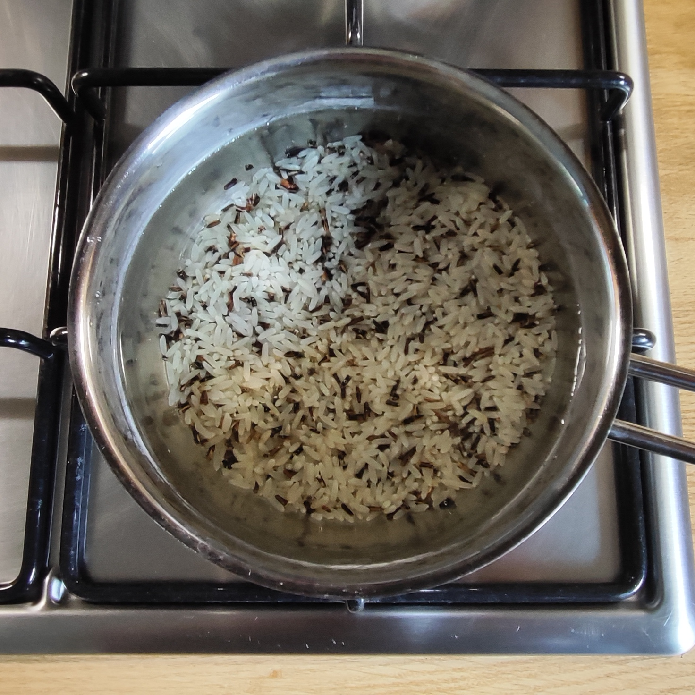
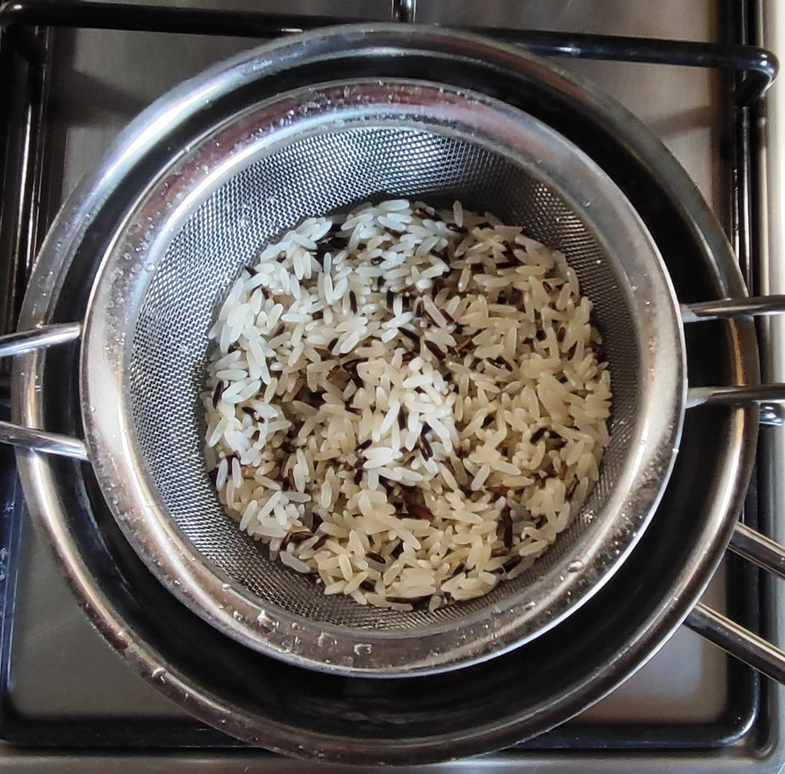
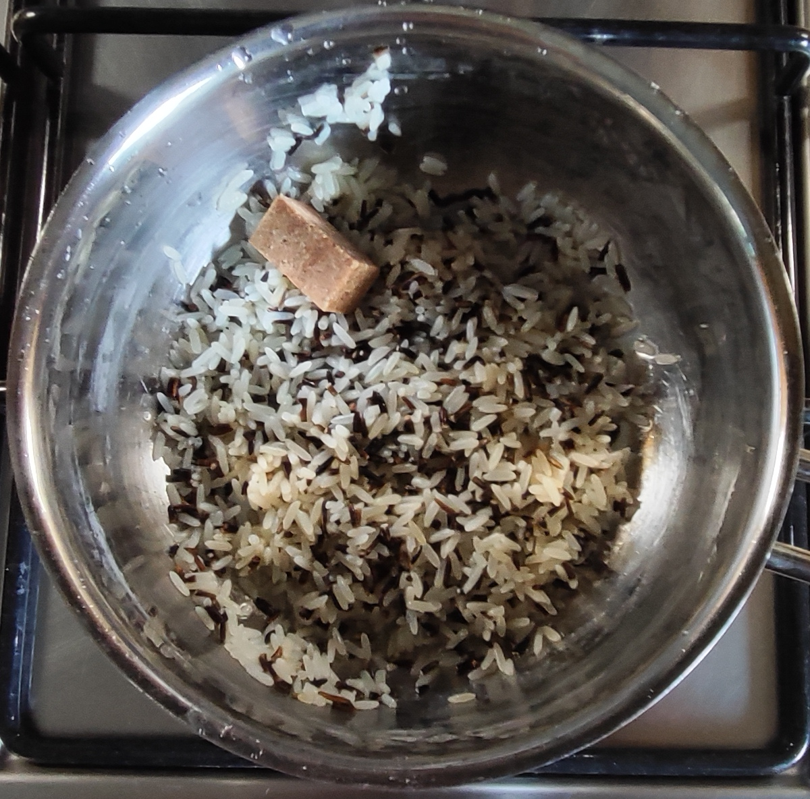
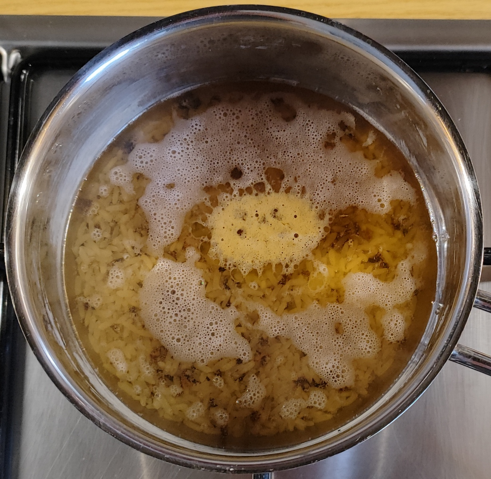
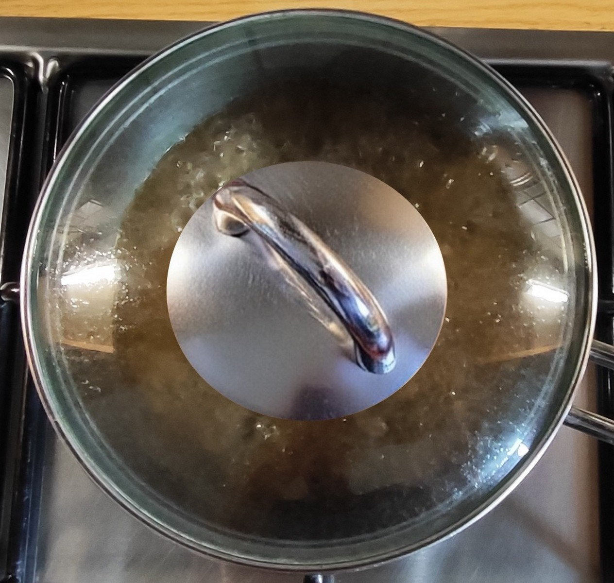
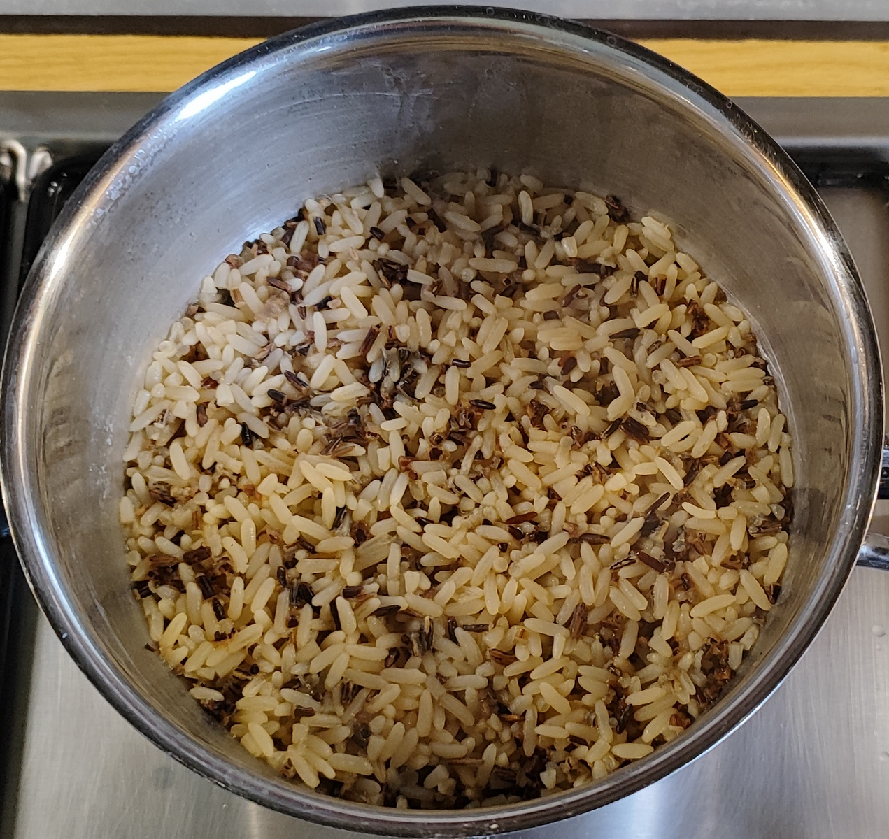

## Kurt bereitet vor - Reis kochen
### Die Quellmethode für den Reis

<table>
  <tr>
    <td></td>
    <td></td>
    <td></td>
    <td></td>
    <td></td>
    <td></td>
  </tr>
  <tr>
    <td align="center">Wässern</td>
    <td align="center">Abspülen</td>
    <td align="center">Brühwürfel dazu</td>
    <td align="center">Wasser dazu</td>
    <td align="center">Köcheln</td>
    <td align="center">Die Brühe ist aufgenommen</td>
  </tr>
</table>

- Den Reis vorab ca. 1 Stunde wässern und gründlich abspülen.  
- Reis, Brühwürfel und Wasser in einen Topf geben.  
- Bei kleiner Hitze abgedeckt ca. 30 Minuten köcheln lassen, bis die Flüssigkeit vollständig aufgenommen wurde. 
 
**Begründung:**  
- **Das 1-stündige Wässern und Abspülen:** Das 1-stündige Wässern und anschließende gründliche Abspülen entzieht den Reiskörnern überschüssige Oberflächenstärke – und gleichzeitig einen Teil des natürlich vorkommenden anorganischen Arsens, das sich vor allem außen am Korn anlagert.  
Dadurch klebt der Reis nach dem Kochen nicht zusammen, bleibt locker und körnig und nimmt später die feine Paprika-Tomaten-Sauce besser auf.   
- **Das Ausquellen im Brühwasser:** Anstatt den Reis in viel Salzwasser zu kochen und abzugießen, gart er bei kleiner Hitze, bis die Flüssigkeit mit dem Brühwürfel vollständig aufsaugt wird (Quellmethode). Dadurch 
wandern alle Aromen der Brühe direkt tief in das Reiskorn, was bei der eher geringen Reismenge für einen intensiven Geschmack sorgt.     
Das ist eine sehr schonende Zubereitung, die dem Reis viel Aroma mitgibt und später Salz spart.
- **Das Verhältnis 1 : 5 (Reis : Wasser) bei der Quellmethode:** Auf den ersten Blick mag diese Wassermenge für die Quellmethode ungewöhnlich hoch erscheinen – die klassische Faustregel für Weißreis liegt bei 1:1,5.  
Hier sind jedoch die spezifische Reiszusammensetzung und die Vorbereitung entscheidend:
  - Parboiled Langkornreis wird industriell unter Druck gedämpft, wodurch die Stärke im Korninneren verkleistert und stabilisiert wird. Das macht die Körner extrem widerstandsfähig – sie zerfallen selbst bei hohem Wasseranteil nicht zu Brei, sondern bleiben fest und getrennt.
  - Wildreis (botanisch ein Sumpfgras-Samen) besitzt eine sehr harte, zähe Außenhülle und benötigt von Natur aus deutlich mehr Flüssigkeit und längere Garzeit, um vollständig aufzuquellen.
  - Das gründliche Abspülen nach dem Wässern entfernt die lose Oberflächenstärke – genau jene Komponente, die bei hohem Wasseranteil normalerweise einen klebrigen „Matsch" erzeugt.
  - Und in 30 min verdampft und entweicht natürlich ein Teil des Wassers trotz Deckel.

Das Ergebnis: Nach 30 Minuten bei kleiner Hitze mit Deckel ist die gesamte Brühe aufgenommen, der Wildreis ist weich und aromatisch, der Parboiled-Reis locker und körnig – genau wie im letzten Bild oben dokumentiert.

---

[← Zurück zur Gemüsepfanne mit Reis](11-gemmitreis.md)

[← Zurück zur Paprika-Zwiebel-Pfanne mit Reis und Ei](11-papr-zwie-reis-ei.md)

[← Zurück zur Paprika-Pilz-Pfanne mit Reis und Ei](11-papr-pilz-reis-ei.md)

[← Zurück zur Übersicht](index.md)
