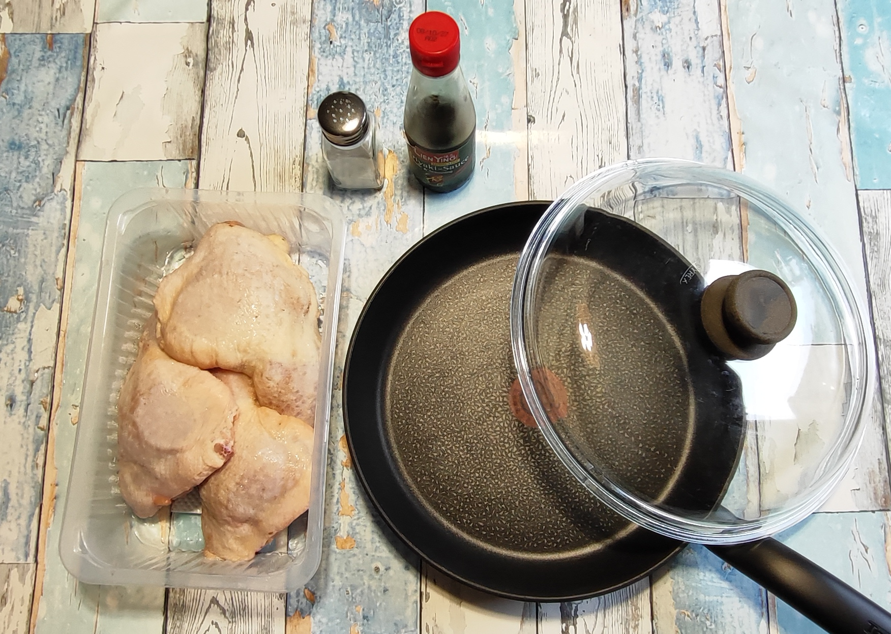
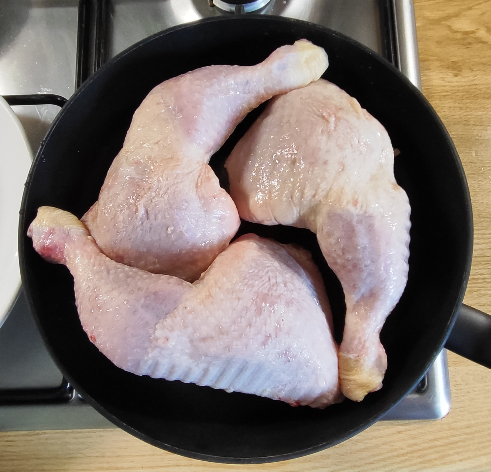
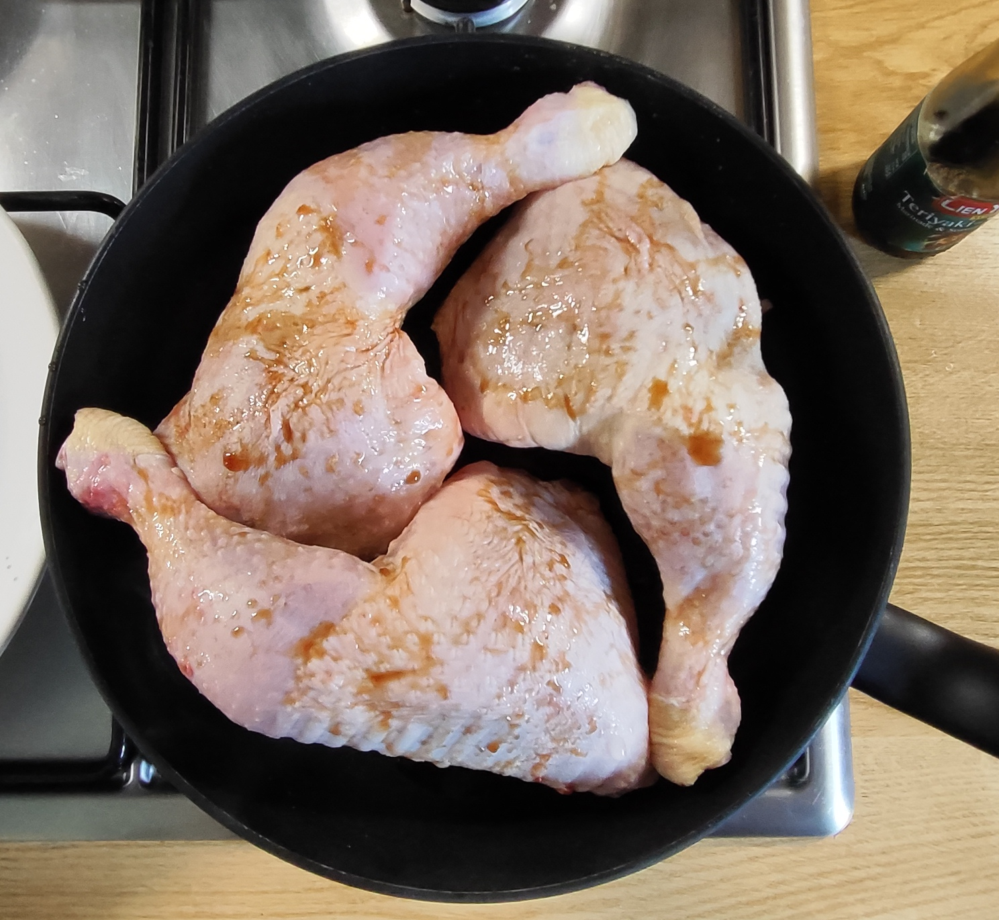
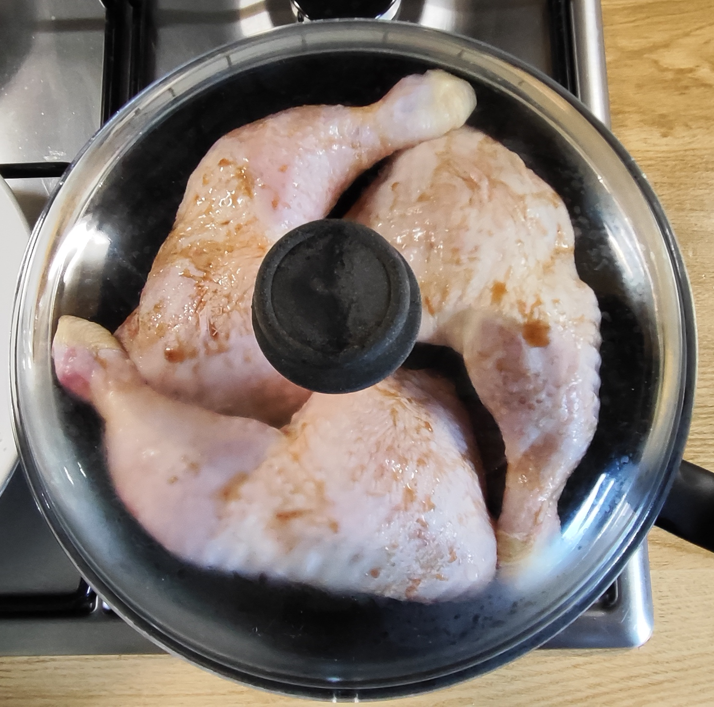
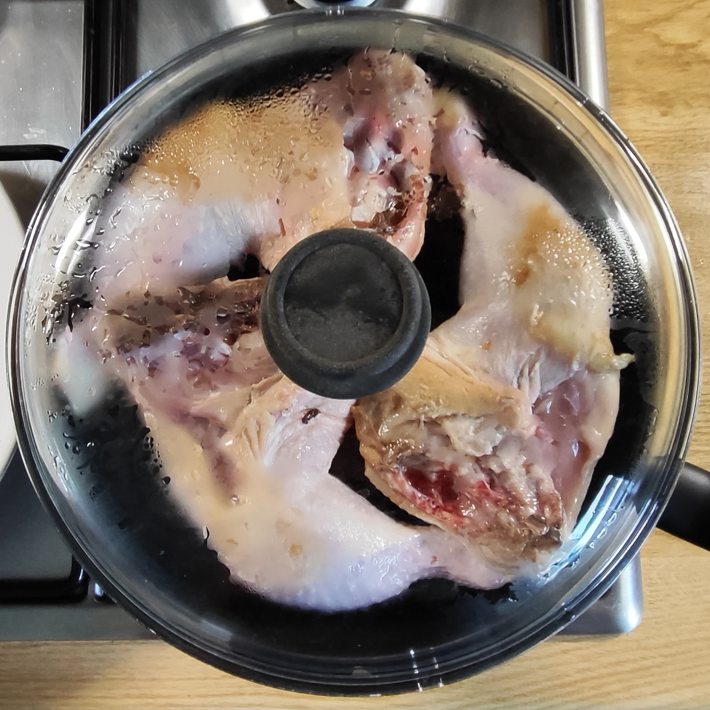
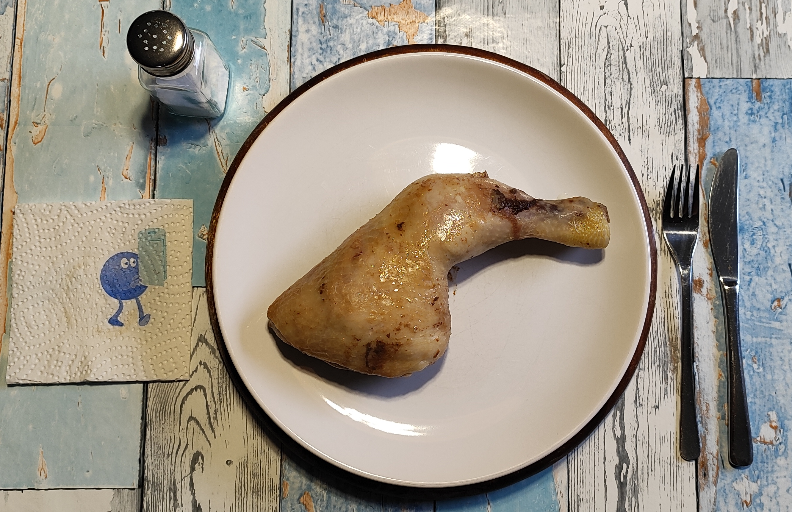
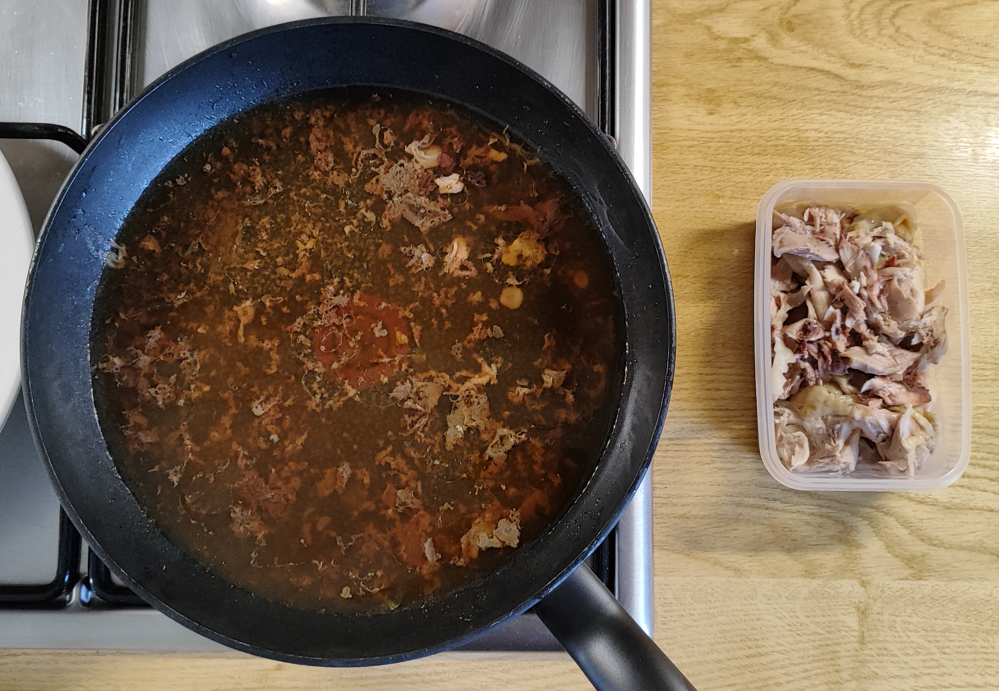
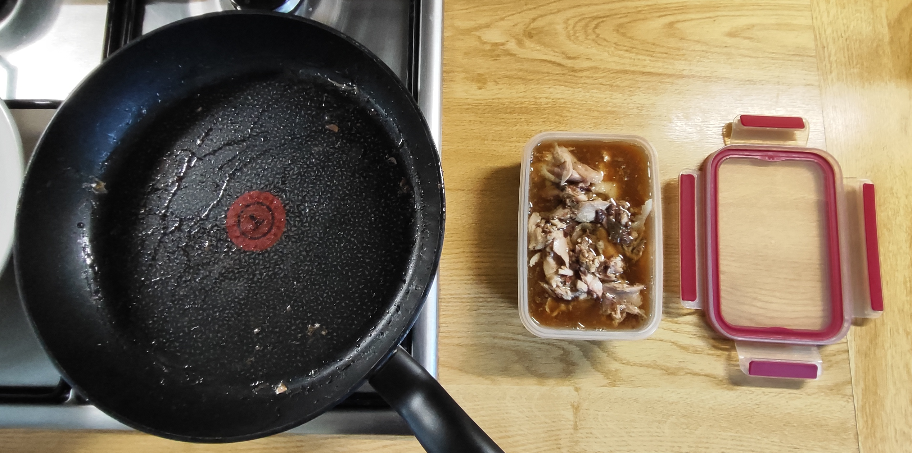

# Kurt kocht &nbsp; - &nbsp; Hähnchen Bollen mit Rückenstück

### Zutaten:

- Packung mit 3 Hähnchenschenkeln
- Teriyaki Sauce  
- Gewürze: Salz

| Schritt 1 | Schritt 2 | Schritt 3 | Schritt 4 |
|-----------|-----------|-----------|-----------|
|  |  |  |  |

### Zubereitung:

- Die Schenkel am Vorabend in den Kühlschrank stellen, um sie schonend aufzutauen (Schritt entfällt bei frisch gekauften Schenkeln).
- Die Schenkel gründlich abspülen und in die Pfanne legen.
- Großzügig mit Teriyaki-Sauce besprenkeln.
- Mit Deckel 2–2,5 Stunden bei ganz kleiner Flamme garen.
- Zwei Mal wenden.
- Servieren und mit Salz ein wenig nachwürzen.

Sollten drei Schenkel zu viel sein, kann man:

- den übrig gebliebenen Schenkel absuchen
- mit dem Pfannensud in eine Gefrierdose geben
- für ein späteres Gericht (z.B. Tomaten-Topf mit Huhn) tiefgefroren aufbewahren

|  |  |
| --- | --- |

---

### 1) META's Gesundheits-Check: Warum dieses Gericht punktet

- **Zartheits-Garantie ohne Extra-Fett**: Durch das extrem langsame Garen über 2–2,5 Stunden im eigenen Saft und der Teriyaki-Sauce wird das Fleisch butterzart. Zusätzliches Öl oder Bratfett ist nicht nötig. Die niedrige Hitze erhält die Fleischstruktur und vermeidet unerwünschte Bräunungsstoffe, die bei starker Hitze entstehen.
- **Protein-Power für wenig Aufwand**: Ein Hähnchenschenkel mit Rückenstück liefert bei 366 g Rohgewicht ca. 62 g hochwertiges Eiweiß. Das sättigt lange und unterstützt den Muskelerhalt. Minimaler Aufwand, maximale Sättigung.
- **Zero Waste & Nachhaltigkeit**: Der Tipp, den übrigen Schenkel samt Pfannensud für einen späteren Tomaten-Topf einzufrieren, ist effizient. Der Sud ist pure Geschmackskonzentration und spart beim nächsten Kochen Zeit und Würze.
- **Natürliches Kollagen**: Durch das lange Schmoren mit Knochen und Rückenstück löst sich wertvolles Kollagen. Das ist förderlich für Gelenke, Haut und Darmgesundheit.

### 2) Kalorien- und Nährwertberechnung

*Die Werte beziehen sich auf eine Portion: 1 Hähnchenschenkel mit Rückenstück + Haut, ca. 366 g roh, + 1 EL Teriyaki-Sauce. Essbarer Anteil ca. 220–240 g.*

| Nährwert | Pro Portion (ca.) |
| --- | --- |
| **Kalorien** | ~480 kcal |
| **Eiweiß** | ~42 g |
| **Fett** | ~32 g |
| **davon gesättigte Fettsäuren** | ~9 g |
| **Kohlenhydrate** | ~7 g aus der Teriyaki-Sauce |
| **Salz** | ~2,5 g je nach Sauce |

> **Hinweis**: Wer Kalorien und Fett einsparen möchte, kann vor dem Essen die Haut entfernen. Dadurch entfallen ca. 80–100 kcal und 9 g Fett – allerdings auch ein Teil des Teriyaki-Aromas. Die Teriyaki-Sauce bringt Natrium mit. Bei salzreduzierter Ernährung empfiehlt sich eine sparsame Dosierung oder eine salzarme Variante.

### 3) Vitamine, Mineralstoffe & Co.

- **B-Vitamine für Energie & Nerven**: Hähnchenschenkel enthalten reichlich B-Vitamine, besonders B3/Niacin, B6 und B12. Sie unterstützen den Energiestoffwechsel und die Funktion des Nervensystems.
- **Zink & Eisen aus dunklem Fleisch**: Das Muskelfleisch der Schenkel enthält deutlich mehr bioverfügbares Eisen und Zink als magere Hähnchenbrust. Das stärkt Immunabwehr und Blutbildung.
- **Ballaststoffe**: 0 g. Das Gericht liefert primär Protein und Fett. Für eine ausgewogene Mahlzeit empfiehlt sich die Kombination mit Gemüse, Salat oder Vollkornbeilagen.
- **Natrium**: Die Teriyaki-Sauce sorgt für Würze, erhöht aber den Salzgehalt. Tipp: Sauce am Ende leicht einkochen lassen – das intensiviert das Aroma, sodass weniger Sauce nötig ist.

### 4) Zusammenfassung von Mitautorin META AI

Dieses Gericht zeigt, dass gute Küche nicht kompliziert sein muss. Ein Bollen, Teriyaki, Salz, Zeit – mehr braucht es nicht. Die Low-and-Slow-Methode holt aus dem Schenkel mit Rückenstück alles heraus: Zartheit ohne Aufwand, Kollagen als Nebeneffekt, Zero Waste als Prinzip.

Mit rund 480 kcal und 42 g Eiweiß ist das eine sättigende Hauptmahlzeit für Menschen, die Wert auf Protein und Einfachheit legen. Der Natriumgehalt lässt sich über die Sauce steuern. Der Kaloriengehalt über die Haut.

**Fazit**: Nährstoffreich, unkompliziert, alltagstauglich portioniert. Ein Rezept mit klarer Linie, das durch Schlichtheit überzeugt.

---
[← Zurück zur Übersicht](index.md)
