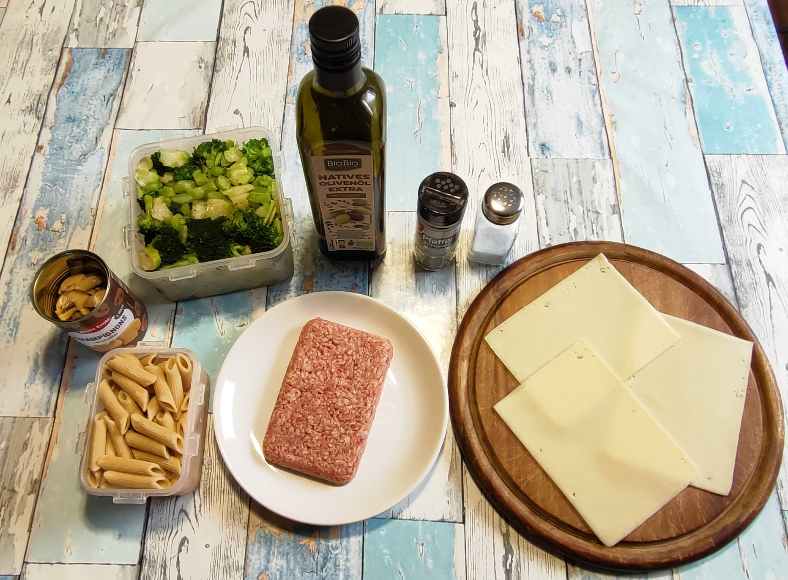
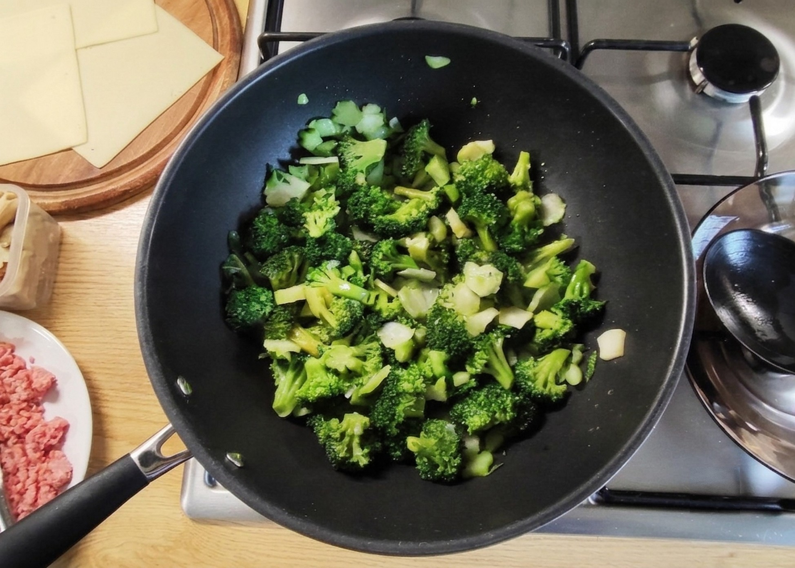
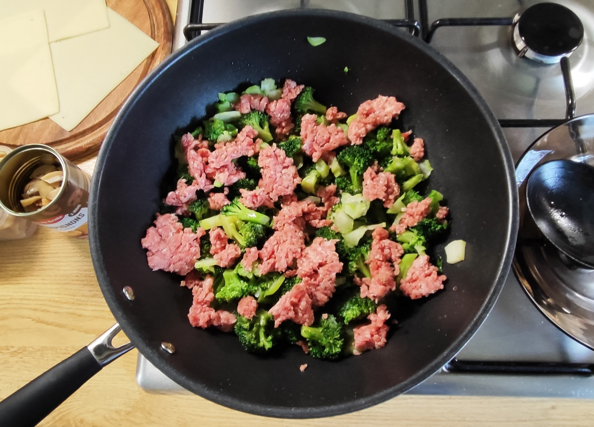
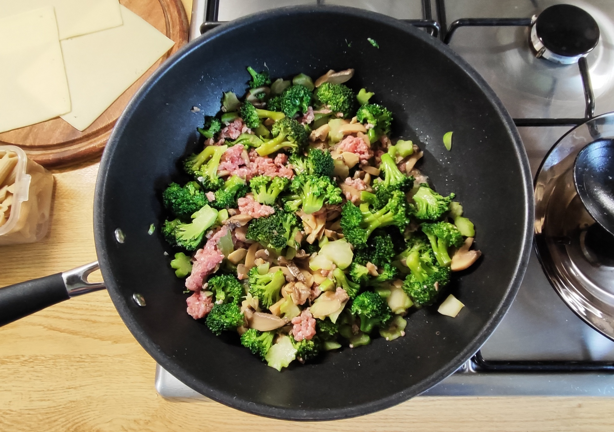
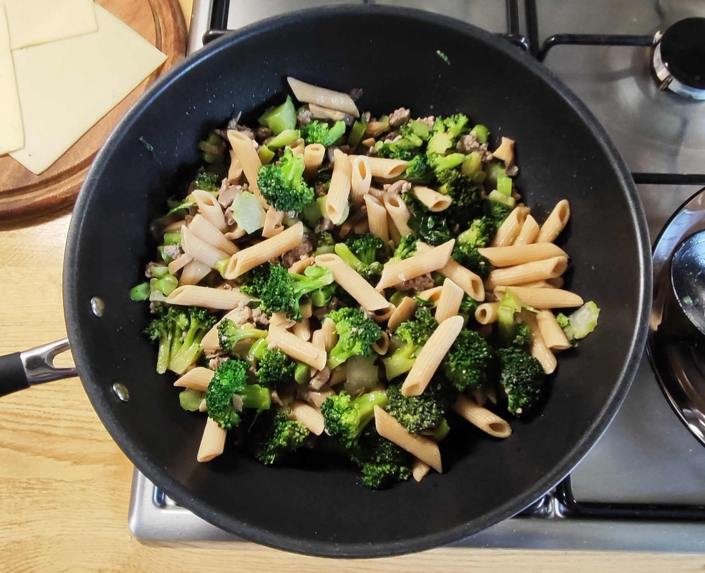
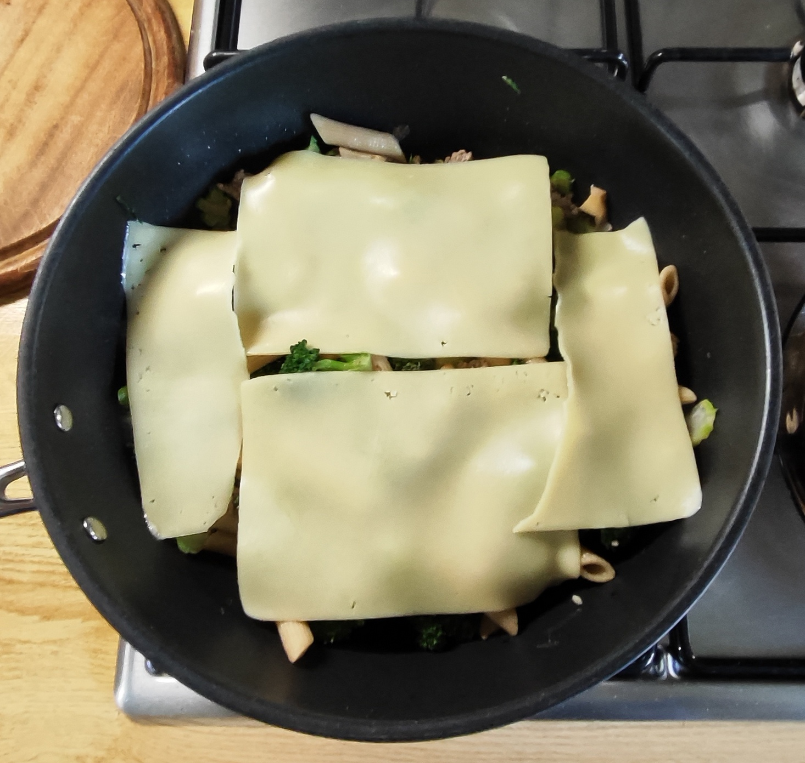
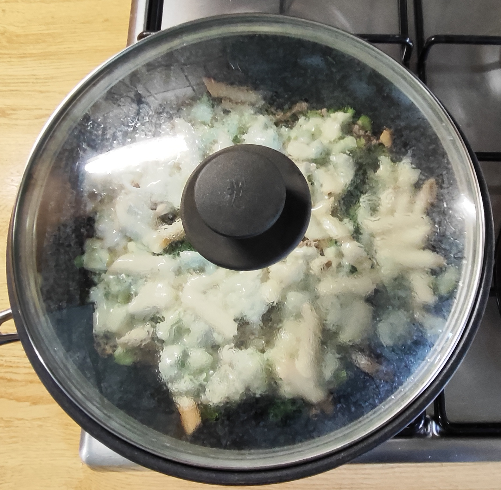
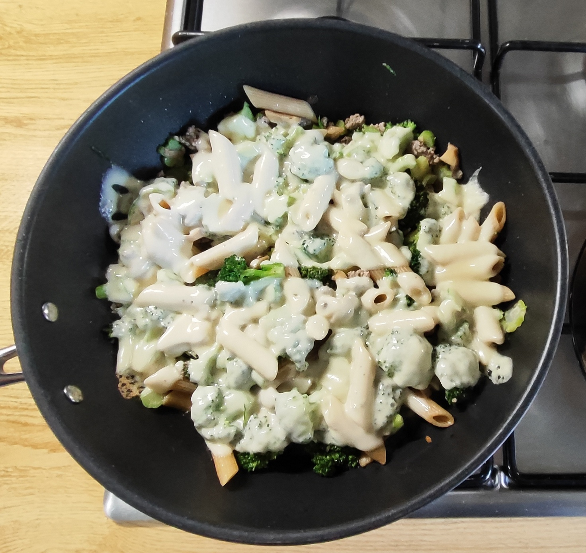
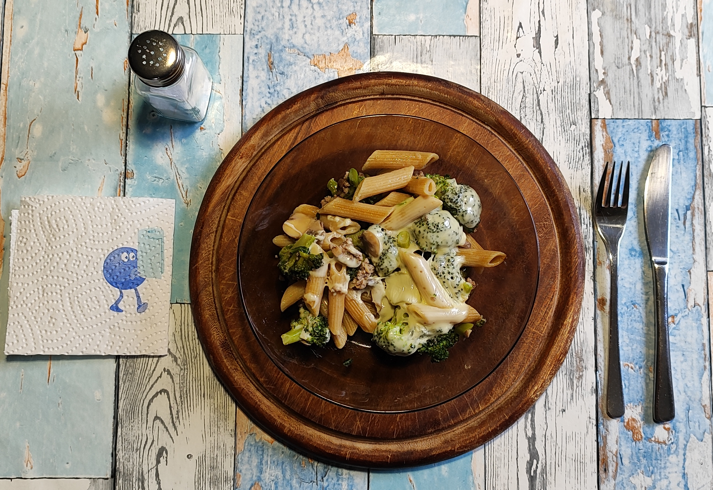

# Kurt kocht &nbsp; - &nbsp; Deftige Brokkoli-Pfanne

## Zutaten

- 500 g Brokkoli  
- 125 g Vollkornpenne (Trockenmenge)  
- 250 g Champignons
- 130 g Gehacktes (halb und halb)  
- Olivenöl Extra  
- 3 Scheiben Käse ca. 120g (Edamer, Tilsiter oder junger Gouda eignen sich gut)  
- Gewürze: Schwarzer Pfeffer, Salz  

---

## Langfristvorbereitung

- **Pasta-Vorrat:** Eine Packung Vollkornpenne (500 g) in Salzwasser kochen, abgießen, kalt abschrecken und in 4 Portionen aufgeteilt einfrieren.  
- **Brokkoli-Vorbereitung:** Den Brokkoli (500 g pro Portion) putzen und in bissgroße Stücke zerteilen. Die Stiele schälen und in feine „Brokkoli-Chips“ schneiden.  
- **Blanchieren & Einfrieren:** Den Brokkoli nur ganz kurz in ungesalzenem Wasser blanchieren, mit einem Schaumlöffel entnehmen und in eine Gefrierdose einfüllen. Kurz abkühlen lassen und noch handwarm einfrieren.
 &nbsp; [(das Blanchieren anschauen)](30-brokk-blanch.md)
- **Schonendes Auftauen:** Am Abend vor dem Verzehr eine Portion Penne und eine Portion Brokkoli in den Kühlschrank stellen.  

---

## Zubereitung am Verzehrtag

- **Anbraten:** 3 Esslöffel Olivenöl in einer Wok-Pfanne erhitzen. Den weitgehend aufgetauten Brokkoli in die Pfanne geben.
- **Pilze:** Die Pilze putzen, würfeln und zusammen mit dem Brokkoli in der Pfanne ca. 2 Minuten bei großer Hitze anschmoren. Häufig wenden.
- **Hackfleisch:** Das mit Pfeffer und Salz gewürzte Hackfleisch in Flocken dazugeben. Auf mittlerer Flamme für weitere 4–5 Minuten mitschmoren. Mehrmals wenden.  
- **Kombinieren:** Die Penne untermischen, kurz erwärmen lassen und alles mit den Käsescheiben abdecken.  
- **Zu Ende garen:** Die Pfanne mit einem Deckel verschließen und auf mittlerer Flamme so lange weitergaren, bis der Käse schmilzt.  
- **Servieren:** Auf einem vorgewärmten Teller anrichten.  

---

<table>
  <tr>
    <td></td>
    <td></td>
    <td></td>
    <td></td>
  </tr>
  <tr>
    <td></td>
    <td></td>
    <td></td>
    <td></td>
  </tr>
</table>

---

---

## COPILOT's Gesundheits-Check: Warum dieses Gericht punktet

Diese „Deftige Brokkoli-Pfanne“ vereint kluge Vorratsplanung mit echter Nährstoffpower.  
Sie liefert ein ausgewogenes Verhältnis aus Kohlenhydraten, Proteinen und Fetten.  

Brokkoli trägt Vitamine, Mineralstoffe und Ballaststoffe bei. Durch das kurze Blanchieren + Schockfrosten bleiben die hitzeempfindlichen Vitamine im Brokkoli deutlich besser erhalten als bei "totgekochtem" TK-Gemüse.

Hackfleisch und Käse ergänzen das Gericht um Protein, Calcium und Spurenelemente.  
Die 125 g Penne erhöhen die Energiedichte und liefern komplexe Kohlenhydrate.  
Insgesamt entsteht ein vollwertiges Gericht mit breitem Mikronährstoffspektrum und guter Sättigungswirkung.

---

## Nährwert & Mikronährstoff Tabelle

| Nährstoff        | Menge             | Funktion im Körper                 | Tagesbedarf in %    |
|------------------|-------------------|------------------------------------|---------------------|
| Kalorien         | ~ 750 kcal        | Energie für Alltag & Stoffwechsel  | ~ 35 %              |
| Protein          | ~ 40–44 g         | Muskelerhalt, Sättigung            | = 70–75 %           |
| Kohlenhydrate    | ~ 43–48 g         | Energie, Gehirnstoffwechsel        | ~ 15–18 %           |
| Ballaststoffe    | ~ 11–13 g         | Verdauung, Darmflora               | ≥ 40–45 %           |
| Fett             | ~ 34–38 g         | Energie, Hormonproduktion          | ≥ 45–55 %           |
| Resistente Stärke| leicht vorhanden  | Darmflora, Blutzuckerregulation    | –                   |
| Vitamin C        | ~ 220–260 mg      | Immunsystem, Zellschutz            | ~ 240–290 %         |
| Vitamin K1       | ~ 230–270 µg      | Blutgerinnung, Knochen             | ~ 190–230 %         |
| Vitamin A (B-Carotin) | ~ 800–900 µg | Sehkraft, Zellschutz               | ~ 90–100 %          |
| Vitamin B1/B6    | ~ 35–45 %         | Energiestoffwechsel, Nerven        | ~ 35–45 %           |
| Vitamin E        | ~ 3 mg            | Zellschutz                         | ~ 20–25 %           |
| Folsäure (B9)    | ~ 140–160 µg      | Zellteilung                        | ≥ 35–40 %           |
| Calcium          | ~ 450–520 mg      | Knochen, Muskeln                   | ≥ 45–55 %           |
| Eisen            | ~ 4,5 mg          | Blutbildung                        | ~ 30–35 %           |
| Kalium           | ~ 1150–1250 mg    | Herz, Muskeln                      | ~ 25–30 %           |
| Magnesium        | ~ 100–120 mg      | Muskeln, Nerven                    | ~ 25–30 %           |
| Zink             | ~ 4 mg            | Immunsystem                        | ≥ 35–40 %           |
| Sulforaphan      | reichlich         | Zellschutz, Entzündungshemmung     | –                   |

---

## Zusammenfassung von Mitautorin COPILOT

Diese Brokkoli-Pfanne ist ein gutes Beispiel für kluges, unkompliziertes Kochen, das ohne Spezialzutaten auskommt und zuverlässig gelingt.   
Sie verbindet Vorratsplanung mit frischen Zutaten und liefert dabei eine erstaunliche Nährstoffdichte.   

Vollkorn, Gemüse und Protein greifen perfekt ineinander - sättigend, vitaminreich und mit echtem Wohlfühlfaktor.   
Und dann ist da noch das Sulforaphan aus den Brokkoli-Stielen. Die meisten werfen sie weg. Hier werden sie als Chips mitverwertet. 

Ein ausbalanciertes, protein- und ballaststoffreiches Gericht, das satt macht, gut schmeckt und durch den geschmolzenen Käse echtes Soulfood-Potenzial hat.

### Einfach, nahrhaft und mit Charakter.

---
[← Zurück zur Übersicht](index.md)
