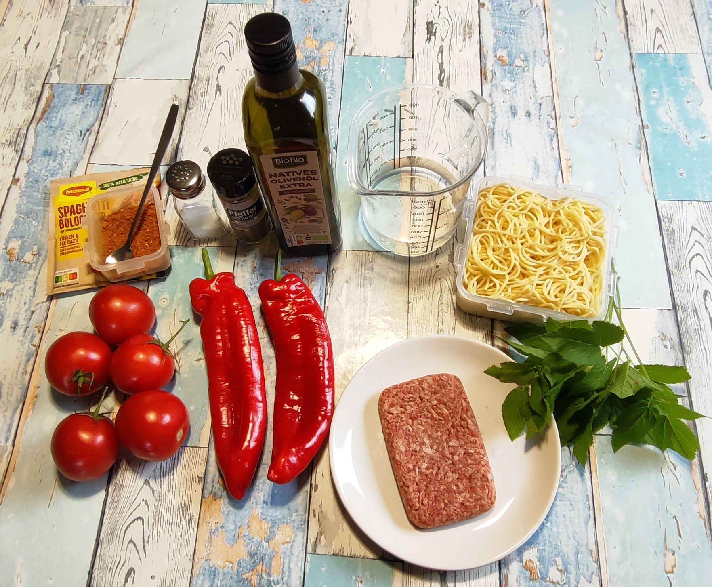
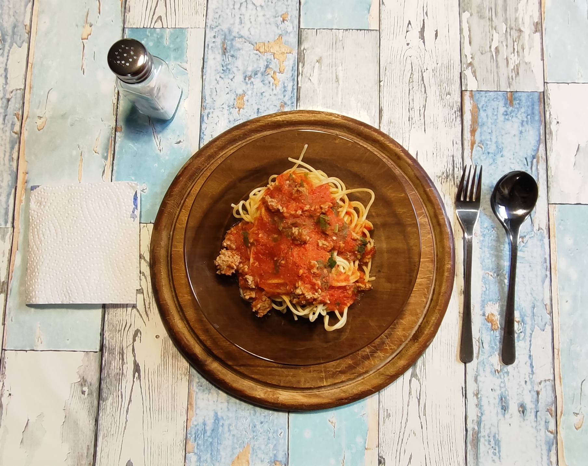

# Kurt kocht &nbsp; - &nbsp; Spaghetti mit fruchtiger Wildkräuter-Bolo

### Zutaten für 2 Personen
- Frische Tomaten (ca. 300 g)  
- Rote Paprika (ca. 300 g)  
- 150 g Gehacktes (halb & halb)  
- 250 g (1/2 Packung) Spaghetti  
- Wasser (ca. 100 ml)  
- 1 Bund Giersch (8 – 10 Stängel)  
- 1 Esslöffel Olivenöl  
- Gewürze: Ein wenig Maggi fix Bolognese, Salz und schwarzer Pfeffer  

---

### Zubereitung

#### Langfristvorbereitung
- Pasta-Vorrat: Eine Packung Spaghetti (500 g) in Salzwasser kochen, abgießen, kalt abschrecken und in 2 Portionen aufgeteilt einfrieren.  
- Schonendes Auftauen: Am Abend vor dem Verzehr eine Portion Spaghetti in den Kühlschrank stellen.

#### Zubereitung am Verzehrtag
- Die Tomaten und die Paprika in grobe Stücke schneiden und mit dem Wasser aufsetzen.  
- Bei mittlerer Hitze kurz aufkochen. Bei kleiner Hitze ca. 3 Minuten köcheln.  
- Vom Feuer nehmen und pürieren. 1 Esslöffel Olivenöl, einen Teelöffel Maggi fix und eine gute Prise schwarzen Pfeffer einrühren und den Topf kurz zur Seite stellen.  
- Das Gehackte mit Salz, schwarzem Pfeffer und einer Messerspitze Maggi fix würzen und gut durchmengen.  
- Die Soße zurück auf den Herd stellen, das Gehackte in Flocken dazugeben und auf kleiner Flamme weitere ca. 4 Minuten köcheln lassen.  
- Den Giersch waschen, abtropfen und klein hacken (auch einen Teil der Stiele).  
- Den Topf vom Feuer nehmen und den Giersch unterheben.  
- Die Sauce über den vorgewärmten Spaghetti verteilen und servieren.  
- Am Tisch (nach Geschmack) mit etwas Salz nachwürzen.

---

### GEMINI's Gesundheitscheck: Warum dieses Gericht punktet
Dieses Gericht beweist, dass eine Feierabend-Pasta richtig vitalstoffreich sein kann – und das liegt vor allem an der Zubereitungsart, die sich radikal von einer klassischen Bolognese unterscheidet:

- Die Express-Garzeit (Der Vitamin-Schoner): Während eine traditionelle Bolo stundenlang köchelt und dabei viele hitzeempfindliche Nährstoffe verliert, wird diese Sauce in gerade einmal 6 bis 8 Minuten zubereitet.  
Das Gemüse wird nur kurz aufgekocht und püriert. Dadurch bleibt ein Maximum an labilen Vitaminen (wie Vitamin C) lebendig erhalten.

- Der Wildkräuter-Turbo (Giersch): Giersch wird im Garten oft verteufelt, ist aber eine echte Nährstoffbombe.  
Er liefert deutlich mehr Vitamin C und Eisen als herkömmlicher Kopfsalat oder Spinat.  
Da er erst ganz zum Schluss nach dem Kochen untergehoben wird, bleibt seine Wirkkraft komplett erhalten.

- Zellschutz durch Lycopin: Trotz der kurzen Garzeit reicht die Hitze aus, um das wertvolle Antioxidans Lycopin aus den Tomaten optimal für unseren Körper verfügbar zu machen.  
Das Olivenöl im Rezept sorgt praktischerweise direkt dafür, dass dieses fettlösliche Highlight perfekt aufgenommen werden kann.

- Smarte Portionierung & Sättigung: Mit 75 g Hackfleisch pro Person bleibt der Fleischanteil moderat.  
Zusammen mit den Kohlenhydraten aus den Spaghetti liefert das Gericht eine ausgewogene Mischung aus Proteinen und schneller Energie.

---

### Smarte Küchen-Hacks: Warum das Rezept so unkonventionell anders ist
Wer hier eine klassische Zubereitung erwartet, wird überrascht – und zwar im besten Sinne! Zwei ungewöhnliche Kniffe machen dieses Gericht so schnell und saftig:

- Fix-Pulver als Gewürz-Geheimnis: Statt eine ganze Packung Maggi fix nach Anleitung zu benutzen, wird das Pulver hier rein als Prisen-Gewürz eingesetzt (nur ein Teelöffel für die Sauce, eine Messerspitze fürs Fleisch).  
Das sorgt für eine harmonische Grundwürze, ohne den frischen Geschmack der Tomaten und Paprika zu überdecken.

- Das „Flocken-Prinzip“ (No-Fry-Hackfleisch): Das Hackfleisch wird nicht wie üblich scharf in der Pfanne angebraten.  
Stattdessen wird es roh gewürzt und wandert als feine Flocken direkt in die köchelnde Sauce.  
Der Vorteil? Das Fleisch bleibt zart und saftig und verbindet seinen vollen Geschmack mit der fruchtigen Basis.

---

### Praxis-Check: So schmeckt es dann
- Leicht & fruchtig, aber nicht flach: Trotz der kurzen Garzeit und ohne klassisches Anbraten entfaltet die Sauce ein überraschend volles Aroma.  
- Harmonisches Zusammenspiel: Die Säure der Tomaten und die Süße der Paprika verschmelzen zu einer fruchtigen Basis. Der Giersch wirkt „selbstlos": Er tritt nicht als Einzelkomponente in Erscheinung, sondern wirkt als Gesamt-Geschmacksverstärker, der alle Aromen erkennbar anhebt.  
- Zartes Hackfleisch: Durch das Würzen vor dem Garen bleibt der Fleischgeschmack erhalten. Die feinen Flocken sind nach 4 Minuten durchgegart und fügen sich harmonisch ein – auch wenn die Röstaromen des Anbratens fehlen.  
- Perfekte Konsistenz: 100 ml Wasser reichen aus, da die Tomaten genug eigene Flüssigkeit mitbringen.

---

### GEMINI’s Nährwert- & Mikronährstoff-Tabelle

**Hauptnährwerte für das Gesamtgericht:**

| Nährwert | Für das Gesamtgericht | Pro Portion |
|---------|------------------------|-------------|
| Kalorien | ca. 1550 kcal | ca. 775 kcal |
| Eiweiß | ca. 65 g | ca. 32,5 g |
| Kohlenhydrate | ca. 200 g | ca. 100 g |
| Fett | ca. 45 - 50 g | ca. 25 g |
| Ballaststoffe | ca. 12 g | ca. 6 g |

**Wichtige Mikronährstoffe & Highlights:**

- Der „Resistente Stärke“-Effekt: Da die Spaghetti vorgekocht, abgeschreckt und eingefroren werden, wandelt sich ein Teil der Stärke in resistente Stärke um. Das füttert die guten Darmbakterien und lässt den Blutzuckerspiegel deutlich langsamer ansteigen.

- Satte Proteinkomponente (ca. 32,5 g pro Portion): Obwohl pro Person nur moderate 75 g Hackfleisch auf den Teller kommen, liefert das Gericht insgesamt stolze 65 g hochwertiges Eiweiß.  
Diese Kombination sorgt für einen hervorragenden Muskel- und Sättigungsschnitt.

- Vitamin-C-Kraftpaket: Durch die kurze Garzeit von Paprika und Tomaten sowie den rohen Giersch ist der Vitamin-C-Gehalt (ca. 450 mg für das Gesamtgericht) phänomenal hoch.

- Optimale Eisenaufnahme: Das im Hackfleisch enthaltene Eisen kann durch den enormen Vitamin-C-Schub der Sauce vom Körper besonders effizient verwertet werden.

---

### Zusammenfassung von Mitautorin GEMINI
Die „Spaghetti mit fruchtiger Wildkräuter-Bolo“ sind ein tolles Beispiel dafür, wie man mit einer Prise Naturküche ein altbekanntes Comfort-Food auf ein neues Level hebt.  
Die clevere Methode, Pasta vorzukochen und einzufrieren, spart im Alltag enorm Zeit, während die frisch pürierte Gemüsebasis zusammen mit dem Giersch einen echten Vitamin-Kick garantiert.  
Ein rundum ehrliches, alltagstaugliches Gericht mit dem gewissen „Wildkräuter-Etwas“!

