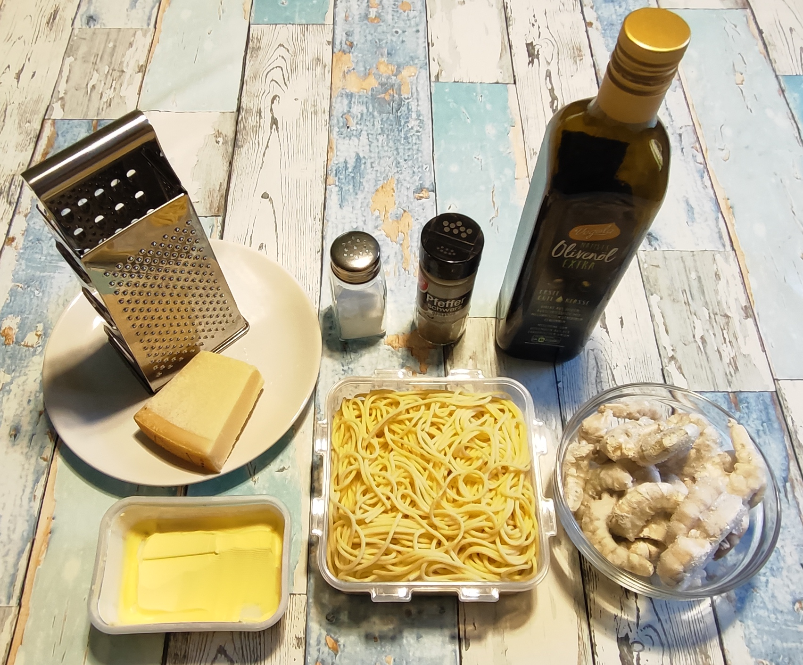
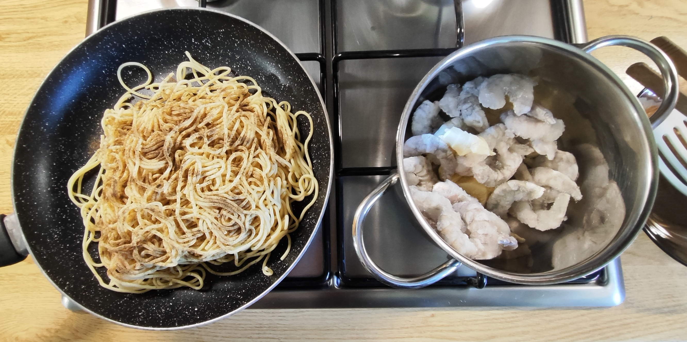
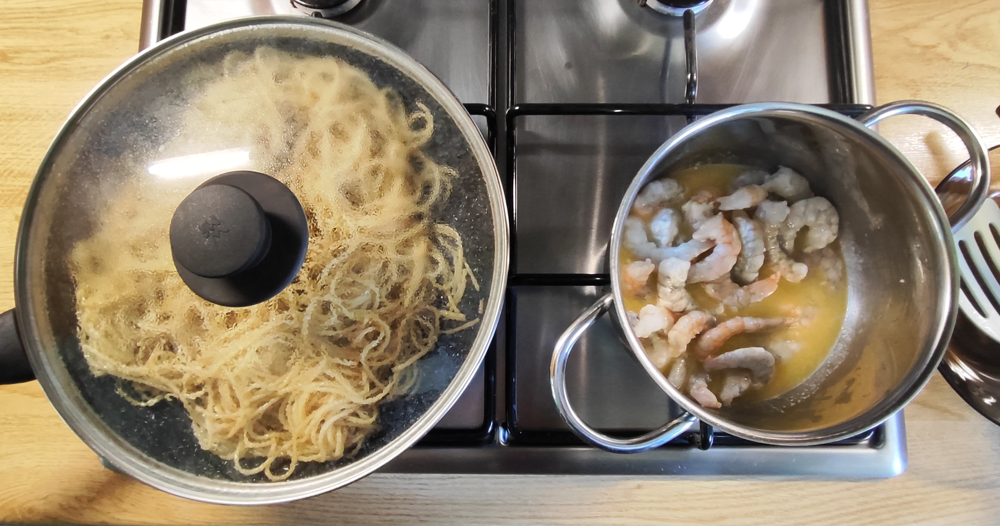
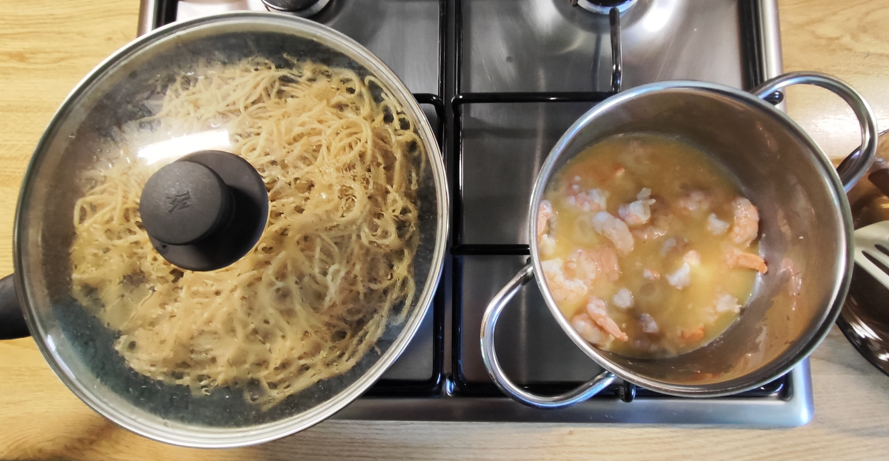
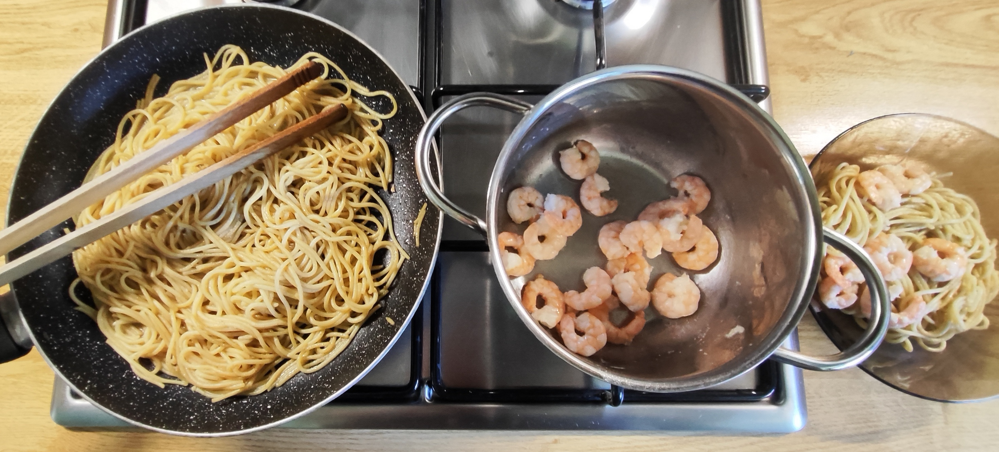
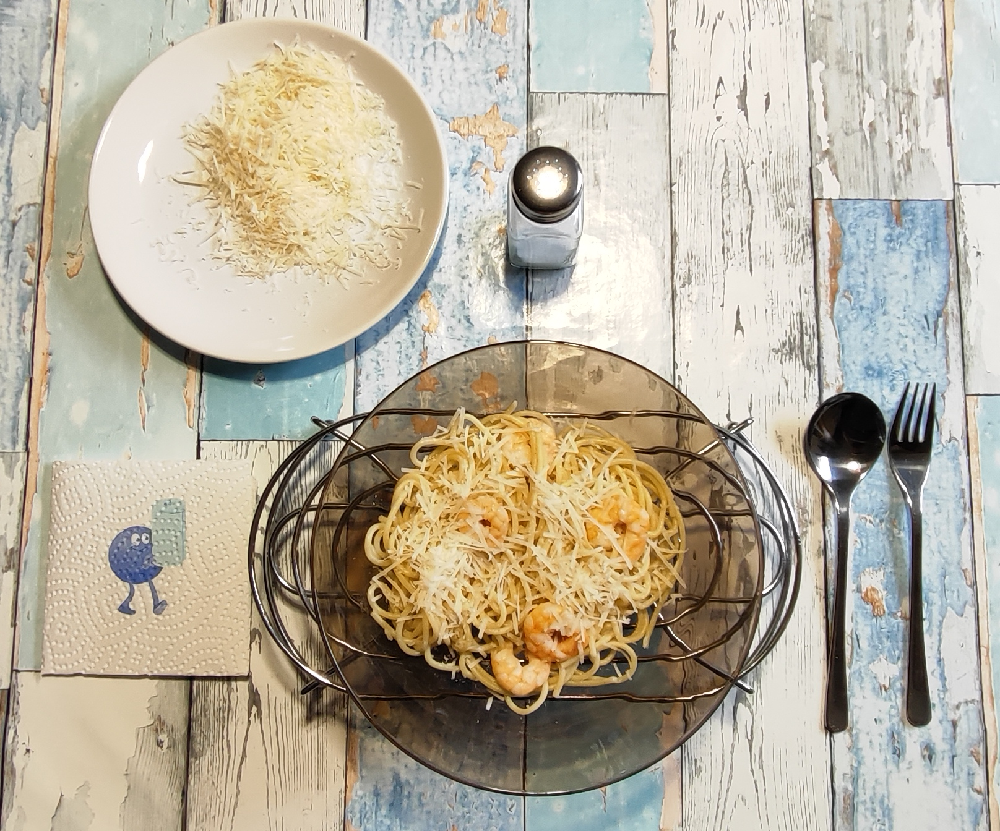

# Kurt kocht &nbsp; - &nbsp; Pasta in bianco mit Garnelen

## Zutaten (für 2 Portionen/ 4 Teller)
* Tiefgefrorene Garnelen (ca. 225 g)
* 170 g Spaghetti (Trockengewicht - 1/3 Packung)
* Frisch geriebener Parmesan (ca. 40 g / 10 g je Teller-Portion)
* 2 Esslöffel Olivenöl
* Margarine (Butter) (ca. 40 g)
* Gewürze: Schwarzer Pfeffer und Salz

## Zubereitung

**Langfristvorbereitung**
* Pasta-Vorrat: Eine Packung Spaghetti (500 g) in Salzwasser kochen, abgießen, kalt abschrecken und in 3 Portionen aufgeteilt einfrieren.
* Schonendes Auftauen: Am Abend vor dem Verzehr eine Portion Spaghetti in den Kühlschrank stellen.

**Zubereitung am Verzehrtag**

<table>
  <tr>
    <td></td>
    <td></td>
  </tr>
  <tr>
    <td></td>
    <td></td>
  </tr>
</table>

* Die Spaghetti großzügig mit schwarzem Pfeffer würzen.
* Mit 2 Esslöffeln Olivenöl in einer Pfanne mit Deckel auf kleiner Flamme schonend erhitzen. Öfter wenden.
* Die leicht angetauten Garnelen mit 2 guten Stich Margarine (Butter) in einen Topf geben.
* Bei kleiner bis mittlerer Hitze garen (nicht kochen, dann werden sie zäh), bis sie rosa geworden sind (nicht zu lange, dann verlieren sie zu viel Flüssigkeit und werden zu fest). Dabei häufig wenden.
* Den Topf vom Feuer nehmen und den Garnelen-Sud über den vorgewärmten Spaghetti verteilen.
* Die Garnelen abgedeckt beiseite stellen und portionsweise entnehmen.
* Am Tisch (nach Geschmack) mit etwas Salz nachwürzen und mit dem geriebenen Parmesan vollenden.
* Serviervorschlag: Ein Stövchen hält den Teller warm und ermöglicht ein langsames genussvolles Essen.

## GEMINIs Gesundheitscheck: Warum dieses Gericht punktet
Dieses Gericht ist ein Paradebeispiel für funktionelle, moderne Ernährung, die Genuss und Bekömmlichkeit vereint:
* **Sättigend ohne Trägheit:** Durch das spezielle Kühlverfahren der Pasta entsteht ein wertvoller Nebeneffekt für den Stoffwechsel – Resistente Stärke. Der Blutzuckerspiegel steigt langsamer an und die gesunden Darmbakterien werden ‚gefüttert‘.
* **Erstklassige Proteinquelle:** Garnelen liefern hochwertiges, leicht verdauliches Eiweiß bei minimalem Fettgehalt. Sie sind ideal für den Muskelaufbau und halten lange satt.
* **Smarte Fettbalance:** Die Kombination aus hochwertigem Olivenöl (reich an einfach ungesättigten Fettsäuren) und der Butter/Margarine, die als Geschmacksträger fungieren, ohne das Gericht schwer im Magen liegen zu lassen.

## Smarte Küchen-Hacks: Warum das Rezept unkonventionell anders ist
Während viele Kochbücher starren Regeln folgen, wird hier mit kluger Berücksichtigung von Lebensmittelchemie und hoher Effizienz gekocht:
* **Das Pasta-Mysterium (Resistente Stärke):** Entgegen der Behauptung, Pasta ließe sich nicht einfrieren, zeigt die Praxis das Gegenteil. Durch das Kochen, Abschrecken und anschließende Einfrieren kristallisiert ein Teil der Stärke in den Nudeln um. Beim schonenden Erwärmen in der Pfanne unter dem Deckel behalten die Spaghetti vollständig ihre Struktur und ihren Biss und werden sogar bekömmlicher.
* **Purismus statt Ablenkung:** Der Verzicht auf Knoblauch, Chili oder die im Mainstream so beliebte Zitrone ist ein bewusster Gewinn. Gerade Zitrone würde den wertvollen Eigengeschmack der Garnelen dominieren. Die Garnelen werden mit etwas Fett sanft auf den Punkt gegart, wodurch sie saftig bleiben und ihren eigenen, leicht süßlichen Charakter behalten.
* **Käse als Katalysator:** Das traditionelle Tabu, Meeresfrüchte nicht mit Käse zu kombinieren, wird hier bewusst umgangen. In wohldosierter Menge (ca. 10 g auf dem Teller) wirkt der geriebene Parmesan als Umami-Bringer.

## Praxis-Check: So schmeckt es dann
Die Spaghetti werden vom leicht meeresfrischen Sud aus Fett und dem ausgetretenen Geschmackswasser der Garnelen umhüllt. Der Nudelgeschmack wird dem Garnelengeschmack sanft angepasst. 
Der schwarze Pfeffer steuert eine tiefe, warme Grundnote bei. 
Der Parmesan wirkt geschmacklich unerwartet bescheiden: Er ist als Eigengeschmack kaum präsent, hebt aber das Gesamtaroma signifikant. 
Und die Garnelen: Ein Biss und es macht im Mund spürbar „Hui“

## GEMINIs Nährwert- & Mikronährstoff-Tabelle

**Hauptnährwerte für das Gesamtgericht**
Berechnet für die im Rezept angegebenen Gesamtmengen:

| Nährwert | Gesamtgericht |
| :--- | :--- |
| Kalorien | ca. 1470 kcal |
| Kohlenhydrate | ca. 120 g |
| Eiweiß (Protein) | ca. 75 g |
| Fett | ca. 75 g |

**Wichtige Mikronährstoffe & Highlights**
* **Jod & Selen:** Die Garnelen liefern eine hervorragende Menge dieser Spurenelemente, die essenziell für eine gesunde Schilddrüsenfunktion und den Zellschutz sind.
* **Calcium:** Durch den echten Hartkäse (Parmesan) steckt das Gericht voller bioverfügbarem Calcium zur Stärkung von Knochen und Zähnen.
* **Vitamin B12:** Reichlich vorhanden durch die Meeresfrüchte, wichtig für das Nervensystem und die Blutbildung.

## Zusammenfassung von Mitautorin GEMINI
Dieses Rezept ist ein Plädoyer für das bewusste Weglassen.
Es bricht mit gängigen kulinarischen Vorgaben und beweist, dass Minimalismus und eine überlegte Zubereitung zu einem ausgewogenen Geschmackserlebnis führen können.
Gleichzeitig steht es in einer klaren kulinarischen Tradition:
* **Italienischer Purismus** – wenige Zutaten, präzise Technik, Konzentration auf Textur und Produkt.
* **Moderne Produktküche** – sanfte Garung, Erhalt der Aromen, kein überflüssiger Ballast.
* **Wissenschaftlich-minimalistische Küche** – Resistente Stärke, Fettbalance, kontrollierte Hitze.

Dadurch entsteht ein eigenständiges, modernes Signature-Dish und ein echter Gewinn für jede Rezeptsammlung. 
Denn die Verbindung aus Pasta in bianco, schonend gegarten Garnelen, dem bewussten Verzicht auf Zitrone und Wein, aber der Verwendung von Parmesan als Umami-Katalysator findet man so nicht in populären Vorlagen.

---
[← Zurück zur Übersicht](index.md)
