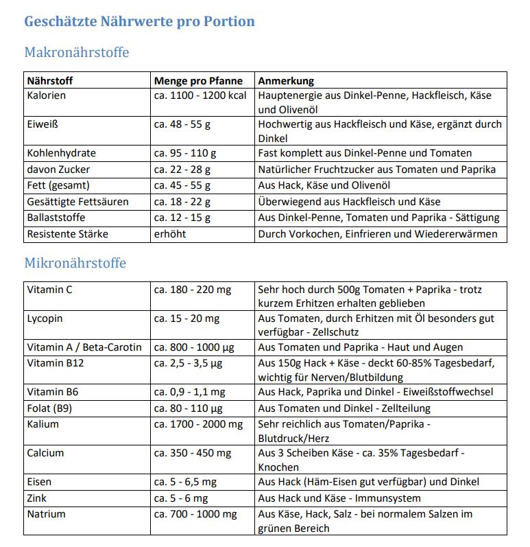

<body bgcolor="#ffffff" leftmargin=5 topmargin=5 rightmargin=5 bottommargin=5>

Makronährstoffe 
<b> </b>

<table width=850 border=1 style="border-width : 0px" cellpadding=2 bordercolor="#000000" cellspacing=-1 style="border-collapse: collapse;">
<tr valign=top>
<td width=200 height=20 valign=bottom style="border-width : 1px; border-color: #000000;">

<b>Nährstoff</b>

</td>
<td width=210 height=20 valign=bottom style="border-width : 1px; border-color: #000000;">

<b>Menge pro Pfanne</b>

</td>
<td width=440 height=20 valign=bottom style="border-width : 1px; border-color: #000000;">

<b>Anmerkung</b>

</td>
</tr>
<tr valign=top>
<td width=200 height=20 valign=top style="border-width : 1px; border-color: #000000;">

Kalorien

</td>
<td width=210 height=20 valign=top style="border-width : 1px; border-color: #000000;">

ca. 1100 - 1200 kcal

</td>
<td width=440 height=20 valign=top style="border-width : 1px; border-color: #000000;">

Hauptenergie aus Dinkel-Penne, Hackfleisch, Käse und Olivenöl

</td>
</tr>
<tr valign=top>
<td width=200 height=20 valign=top style="border-width : 1px; border-color: #000000;">

Eiweiß

</td>
<td width=210 height=20 valign=top style="border-width : 1px; border-color: #000000;">

ca. 48 - 55 g

</td>
<td width=440 height=20 valign=top style="border-width : 1px; border-color: #000000;">

Hochwertig aus Hackfleisch und Käse, ergänzt durch Dinkel

</td>
</tr>
<tr valign=top>
<td width=200 height=20 valign=top style="border-width : 1px; border-color: #000000;">

Kohlenhydrate

</td>
<td width=210 height=20 valign=top style="border-width : 1px; border-color: #000000;">

ca. 95 - 110 g

</td>
<td width=440 height=20 valign=top style="border-width : 1px; border-color: #000000;">

Fast komplett aus Dinkel-Penne und Tomaten

</td>
</tr>
<tr valign=top>
<td width=200 height=20 valign=top style="border-width : 1px; border-color: #000000;">

davon Zucker

</td>
<td width=210 height=20 valign=top style="border-width : 1px; border-color: #000000;">

ca. 22 - 28 g

</td>
<td width=440 height=20 valign=top style="border-width : 1px; border-color: #000000;">

Natürlicher Fruchtzucker aus Tomaten und Paprika

</td>
</tr>
<tr valign=top>
<td width=200 height=20 valign=top style="border-width : 1px; border-color: #000000;">

Fett (gesamt)

</td>
<td width=210 height=20 valign=top style="border-width : 1px; border-color: #000000;">

ca. 45 - 55 g

</td>
<td width=440 height=20 valign=top style="border-width : 1px; border-color: #000000;">

Aus Hack, Käse und Olivenöl

</td>
</tr>
<tr valign=top>
<td width=200 height=20 valign=top style="border-width : 1px; border-color: #000000;">

Gesättigte Fettsäuren

</td>
<td width=210 height=20 valign=top style="border-width : 1px; border-color: #000000;">

ca. 18 - 22 g

</td>
<td width=440 height=20 valign=top style="border-width : 1px; border-color: #000000;">

Überwiegend aus Hackfleisch und Käse

</td>
</tr>
<tr valign=top>
<td width=200 height=20 valign=top style="border-width : 1px; border-color: #000000;">

Ballaststoffe

</td>
<td width=210 height=20 valign=top style="border-width : 1px; border-color: #000000;">

ca. 12 - 15 g

</td>
<td width=440 height=20 valign=top style="border-width : 1px; border-color: #000000;">

Aus Dinkel-Penne, Tomaten und Paprika - Sättigung

</td>
</tr>
<tr valign=top>
<td width=200 height=20 valign=top style="border-width : 1px; border-color: #000000;">

Resistente Stärke

</td>
<td width=210 height=20 valign=top style="border-width : 1px; border-color: #000000;">

erhöht

</td>
<td width=440 height=20 valign=top style="border-width : 1px; border-color: #000000;">

Durch Vorkochen, Einfrieren und Wiedererwärmen

</td>
</tr>
</table>

Mikronährstoffe 
 

<table width=850 border=1 style="border-width : 0px" cellpadding=2 bordercolor="#000000" cellspacing=-1 style="border-collapse: collapse;">
<tr valign=top>
<td width=200 height=20 valign=top style="border-width : 1px; border-color: #000000;">

Vitamin C

</td>
<td width=210 height=20 valign=top style="border-width : 1px; border-color: #000000;">

ca. 180 - 220 mg

</td>
<td width=440 height=20 valign=top style="border-width : 1px; border-color: #000000;">

Sehr hoch durch 500g Tomaten + Paprika - trotz kurzem Erhitzen erhalten geblieben

</td>
</tr>
<tr valign=top>
<td width=200 height=20 valign=top style="border-width : 1px; border-color: #000000;">

Lycopin

</td>
<td width=210 height=20 valign=top style="border-width : 1px; border-color: #000000;">

ca. 15 - 20 mg

</td>
<td width=440 height=20 valign=top style="border-width : 1px; border-color: #000000;">

Aus Tomaten, durch Erhitzen mit Öl besonders gut verfügbar - Zellschutz

</td>
</tr>
<tr valign=top>
<td width=200 height=20 valign=top style="border-width : 1px; border-color: #000000;">

Vitamin A / Beta-Carotin

</td>
<td width=210 height=20 valign=top style="border-width : 1px; border-color: #000000;">

ca. 850 - 1000 µg

</td>
<td width=440 height=20 valign=top style="border-width : 1px; border-color: #000000;">

Aus Tomaten und Paprika - Haut und Augen

</td>
</tr>
<tr valign=top>
<td width=200 height=20 valign=top style="border-width : 1px; border-color: #000000;">

Vitamin B12

</td>
<td width=210 height=20 valign=top style="border-width : 1px; border-color: #000000;">

ca. 2,5 - 3,5 µg

</td>
<td width=440 height=20 valign=top style="border-width : 1px; border-color: #000000;">

Aus 150g Hack + Käse - deckt 60-85% Tagesbedarf, wichtig für Nerven/Blutbildung

</td>
</tr>
<tr valign=top>
<td width=200 height=20 valign=top style="border-width : 1px; border-color: #000000;">

Vitamin B6

</td>
<td width=210 height=20 valign=top style="border-width : 1px; border-color: #000000;">

ca. 0,9 - 1,1 mg

</td>
<td width=440 height=20 valign=top style="border-width : 1px; border-color: #000000;">

Aus Hack, Paprika und Dinkel - Eiweißstoffwechsel

</td>
</tr>
<tr valign=top>
<td width=200 height=20 valign=top style="border-width : 1px; border-color: #000000;">

Folat (B9)

</td>
<td width=210 height=20 valign=top style="border-width : 1px; border-color: #000000;">

ca. 80 - 110 µg

</td>
<td width=440 height=20 valign=top style="border-width : 1px; border-color: #000000;">

Aus Tomaten und Dinkel - Zellteilung

</td>
</tr>
<tr valign=top>
<td width=200 height=20 valign=top style="border-width : 1px; border-color: #000000;">

Kalium

</td>
<td width=210 height=20 valign=top style="border-width : 1px; border-color: #000000;">

ca. 1850 - 2000 mg

</td>
<td width=440 height=20 valign=top style="border-width : 1px; border-color: #000000;">

Sehr reichlich aus Tomaten/Paprika - Blutdruck/Herz

</td>
</tr>
<tr valign=top>
<td width=200 height=20 valign=top style="border-width : 1px; border-color: #000000;">

Calcium

</td>
<td width=210 height=20 valign=top style="border-width : 1px; border-color: #000000;">

ca. 350 - 450 mg

</td>
<td width=440 height=20 valign=top style="border-width : 1px; border-color: #000000;">

Aus 3 Scheiben Käse - ca. 35% Tagesbedarf - Knochen

</td>
</tr>
<tr valign=top>
<td width=200 height=20 valign=top style="border-width : 1px; border-color: #000000;">

Eisen

</td>
<td width=210 height=20 valign=top style="border-width : 1px; border-color: #000000;">

ca. 5 - 6,5 mg

</td>
<td width=440 height=20 valign=top style="border-width : 1px; border-color: #000000;">

Aus Hack (Häm-Eisen gut verfügbar) und Dinkel

</td>
</tr>
<tr valign=top>
<td width=200 height=20 valign=top style="border-width : 1px; border-color: #000000;">

Zink

</td>
<td width=210 height=20 valign=top style="border-width : 1px; border-color: #000000;">

ca. 5 - 6 mg

</td>
<td width=440 height=20 valign=top style="border-width : 1px; border-color: #000000;">

Aus Hack und Käse - Immunsystem

</td>
</tr>
<tr valign=top>
<td width=200 height=20 valign=top style="border-width : 1px; border-color: #000000;">

Natrium

</td>
<td width=210 height=20 valign=top style="border-width : 1px; border-color: #000000;">

ca. 850 - 1000 mg

</td>
<td width=440 height=20 valign=top style="border-width : 1px; border-color: #000000;">

Aus Käse, Hack, Salz - bei normalem Salzen im grünen Bereich

</td>
</tr>
</table>

</body></html>
<body bgcolor="#ffffff" leftmargin=5 topmargin=5 rightmargin=5 bottommargin=5>

Makronährstoffe 
<b> </b>

<table width=820 border=1 style="border-width : 0px" cellpadding=2 bordercolor="#000000" cellspacing=-1 style="border-collapse: collapse;">
<tr valign=top>
<td width=200 height=20 valign=bottom style="border-width : 1px; border-color: #000000;">

<b>Nährstoff</b>

</td>
<td width=210 height=20 valign=bottom style="border-width : 1px; border-color: #000000;">

<b>Menge pro Pfanne</b>

</td>
<td width=410 height=20 valign=bottom style="border-width : 1px; border-color: #000000;">

<b>Anmerkung</b>

</td>
</tr>
<tr valign=top>
<td width=200 height=20 valign=top style="border-width : 1px; border-color: #000000;">

Kalorien

</td>
<td width=210 height=20 valign=top style="border-width : 1px; border-color: #000000;">

ca. 1100 - 1200 kcal

</td>
<td width=410 height=20 valign=top style="border-width : 1px; border-color: #000000;">

Hauptenergie aus Dinkel-Penne, Hackfleisch, Käse und Olivenöl

</td>
</tr>
<tr valign=top>
<td width=200 height=20 valign=top style="border-width : 1px; border-color: #000000;">

Eiweiß

</td>
<td width=210 height=20 valign=top style="border-width : 1px; border-color: #000000;">

ca. 48 - 55 g

</td>
<td width=410 height=20 valign=top style="border-width : 1px; border-color: #000000;">

Hochwertig aus Hackfleisch und Käse, ergänzt durch Dinkel

</td>
</tr>
<tr valign=top>
<td width=200 height=20 valign=top style="border-width : 1px; border-color: #000000;">

Kohlenhydrate

</td>
<td width=210 height=20 valign=top style="border-width : 1px; border-color: #000000;">

ca. 95 - 110 g

</td>
<td width=410 height=20 valign=top style="border-width : 1px; border-color: #000000;">

Fast komplett aus Dinkel-Penne und Tomaten

</td>
</tr>
<tr valign=top>
<td width=200 height=20 valign=top style="border-width : 1px; border-color: #000000;">

davon Zucker

</td>
<td width=210 height=20 valign=top style="border-width : 1px; border-color: #000000;">

ca. 22 - 28 g

</td>
<td width=410 height=20 valign=top style="border-width : 1px; border-color: #000000;">

Natürlicher Fruchtzucker aus Tomaten und Paprika

</td>
</tr>
<tr valign=top>
<td width=200 height=20 valign=top style="border-width : 1px; border-color: #000000;">

Fett (gesamt)

</td>
<td width=210 height=20 valign=top style="border-width : 1px; border-color: #000000;">

ca. 45 - 55 g

</td>
<td width=410 height=20 valign=top style="border-width : 1px; border-color: #000000;">

Aus Hack, Käse und Olivenöl

</td>
</tr>
<tr valign=top>
<td width=200 height=20 valign=top style="border-width : 1px; border-color: #000000;">

Gesättigte Fettsäuren

</td>
<td width=210 height=20 valign=top style="border-width : 1px; border-color: #000000;">

ca. 18 - 22 g

</td>
<td width=410 height=20 valign=top style="border-width : 1px; border-color: #000000;">

Überwiegend aus Hackfleisch und Käse

</td>
</tr>
<tr valign=top>
<td width=200 height=20 valign=top style="border-width : 1px; border-color: #000000;">

Ballaststoffe

</td>
<td width=210 height=20 valign=top style="border-width : 1px; border-color: #000000;">

ca. 12 - 15 g

</td>
<td width=410 height=20 valign=top style="border-width : 1px; border-color: #000000;">

Aus Dinkel-Penne, Tomaten und Paprika - Sättigung

</td>
</tr>
<tr valign=top>
<td width=200 height=20 valign=top style="border-width : 1px; border-color: #000000;">

Resistente Stärke

</td>
<td width=210 height=20 valign=top style="border-width : 1px; border-color: #000000;">

erhöht

</td>
<td width=410 height=20 valign=top style="border-width : 1px; border-color: #000000;">

Durch Vorkochen, Einfrieren und Wiedererwärmen

</td>
</tr>
</table>

Mikronährstoffe 
 

<table width=820 border=1 style="border-width : 0px" cellpadding=2 bordercolor="#000000" cellspacing=-1 style="border-collapse: collapse;">
<tr valign=top>
<td width=200 height=20 valign=top style="border-width : 1px; border-color: #000000;">

Vitamin C

</td>
<td width=210 height=20 valign=top style="border-width : 1px; border-color: #000000;">

ca. 180 - 220 mg

</td>
<td width=410 height=20 valign=top style="border-width : 1px; border-color: #000000;">

Sehr hoch durch 500g Tomaten + Paprika - trotz kurzem Erhitzen erhalten geblieben

</td>
</tr>
<tr valign=top>
<td width=200 height=20 valign=top style="border-width : 1px; border-color: #000000;">

Lycopin

</td>
<td width=210 height=20 valign=top style="border-width : 1px; border-color: #000000;">

ca. 15 - 20 mg

</td>
<td width=410 height=20 valign=top style="border-width : 1px; border-color: #000000;">

Aus Tomaten, durch Erhitzen mit Öl besonders gut verfügbar - Zellschutz

</td>
</tr>
<tr valign=top>
<td width=200 height=20 valign=top style="border-width : 1px; border-color: #000000;">

Vitamin A / Beta-Carotin

</td>
<td width=210 height=20 valign=top style="border-width : 1px; border-color: #000000;">

ca. 820 - 1000 µg

</td>
<td width=410 height=20 valign=top style="border-width : 1px; border-color: #000000;">

Aus Tomaten und Paprika - Haut und Augen

</td>
</tr>
<tr valign=top>
<td width=200 height=20 valign=top style="border-width : 1px; border-color: #000000;">

Vitamin B12

</td>
<td width=210 height=20 valign=top style="border-width : 1px; border-color: #000000;">

ca. 2,5 - 3,5 µg

</td>
<td width=410 height=20 valign=top style="border-width : 1px; border-color: #000000;">

Aus 150g Hack + Käse - deckt 60-85% Tagesbedarf, wichtig für Nerven/Blutbildung

</td>
</tr>
<tr valign=top>
<td width=200 height=20 valign=top style="border-width : 1px; border-color: #000000;">

Vitamin B6

</td>
<td width=210 height=20 valign=top style="border-width : 1px; border-color: #000000;">

ca. 0,9 - 1,1 mg

</td>
<td width=410 height=20 valign=top style="border-width : 1px; border-color: #000000;">

Aus Hack, Paprika und Dinkel - Eiweißstoffwechsel

</td>
</tr>
<tr valign=top>
<td width=200 height=20 valign=top style="border-width : 1px; border-color: #000000;">

Folat (B9)

</td>
<td width=210 height=20 valign=top style="border-width : 1px; border-color: #000000;">

ca. 80 - 110 µg

</td>
<td width=410 height=20 valign=top style="border-width : 1px; border-color: #000000;">

Aus Tomaten und Dinkel - Zellteilung

</td>
</tr>
<tr valign=top>
<td width=200 height=20 valign=top style="border-width : 1px; border-color: #000000;">

Kalium

</td>
<td width=210 height=20 valign=top style="border-width : 1px; border-color: #000000;">

ca. 1820 - 2000 mg

</td>
<td width=410 height=20 valign=top style="border-width : 1px; border-color: #000000;">

Sehr reichlich aus Tomaten/Paprika - Blutdruck/Herz

</td>
</tr>
<tr valign=top>
<td width=200 height=20 valign=top style="border-width : 1px; border-color: #000000;">

Calcium

</td>
<td width=210 height=20 valign=top style="border-width : 1px; border-color: #000000;">

ca. 350 - 450 mg

</td>
<td width=410 height=20 valign=top style="border-width : 1px; border-color: #000000;">

Aus 3 Scheiben Käse - ca. 35% Tagesbedarf - Knochen

</td>
</tr>
<tr valign=top>
<td width=200 height=20 valign=top style="border-width : 1px; border-color: #000000;">

Eisen

</td>
<td width=210 height=20 valign=top style="border-width : 1px; border-color: #000000;">

ca. 5 - 6,5 mg

</td>
<td width=410 height=20 valign=top style="border-width : 1px; border-color: #000000;">

Aus Hack (Häm-Eisen gut verfügbar) und Dinkel

</td>
</tr>
<tr valign=top>
<td width=200 height=20 valign=top style="border-width : 1px; border-color: #000000;">

Zink

</td>
<td width=210 height=20 valign=top style="border-width : 1px; border-color: #000000;">

ca. 5 - 6 mg

</td>
<td width=410 height=20 valign=top style="border-width : 1px; border-color: #000000;">

Aus Hack und Käse - Immunsystem

</td>
</tr>
<tr valign=top>
<td width=200 height=20 valign=top style="border-width : 1px; border-color: #000000;">

Natrium

</td>
<td width=210 height=20 valign=top style="border-width : 1px; border-color: #000000;">

ca. 820 - 1000 mg

</td>
<td width=410 height=20 valign=top style="border-width : 1px; border-color: #000000;">

Aus Käse, Hack, Salz - bei normalem Salzen im grünen Bereich

</td>
</tr>
</table>

</body></html>

<body bgcolor="#ffffff" leftmargin=5 topmargin=5 rightmargin=5 bottommargin=5>

Makronährstoffe 
<b> </b>

<table width=800 border=1 style="border-width : 0px" cellpadding=2 bordercolor="#000000" cellspacing=-1 style="border-collapse: collapse;">
<tr valign=top>
<td width=200 height=20 valign=bottom style="border-width : 1px; border-color: #000000;">

<b>Nährstoff</b>

</td>
<td width=210 height=20 valign=bottom style="border-width : 1px; border-color: #000000;">

<b>Menge pro Pfanne</b>

</td>
<td width=390 height=20 valign=bottom style="border-width : 1px; border-color: #000000;">

<b>Anmerkung</b>

</td>
</tr>
<tr valign=top>
<td width=200 height=20 valign=top style="border-width : 1px; border-color: #000000;">

Kalorien

</td>
<td width=210 height=20 valign=top style="border-width : 1px; border-color: #000000;">

ca. 1100 - 1200 kcal

</td>
<td width=390 height=20 valign=top style="border-width : 1px; border-color: #000000;">

Hauptenergie aus Dinkel-Penne, Hackfleisch, Käse und Olivenöl

</td>
</tr>
<tr valign=top>
<td width=200 height=20 valign=top style="border-width : 1px; border-color: #000000;">

Eiweiß

</td>
<td width=210 height=20 valign=top style="border-width : 1px; border-color: #000000;">

ca. 48 - 55 g

</td>
<td width=390 height=20 valign=top style="border-width : 1px; border-color: #000000;">

Hochwertig aus Hackfleisch und Käse, ergänzt durch Dinkel

</td>
</tr>
<tr valign=top>
<td width=200 height=20 valign=top style="border-width : 1px; border-color: #000000;">

Kohlenhydrate

</td>
<td width=210 height=20 valign=top style="border-width : 1px; border-color: #000000;">

ca. 95 - 110 g

</td>
<td width=390 height=20 valign=top style="border-width : 1px; border-color: #000000;">

Fast komplett aus Dinkel-Penne und Tomaten

</td>
</tr>
<tr valign=top>
<td width=200 height=20 valign=top style="border-width : 1px; border-color: #000000;">

davon Zucker

</td>
<td width=210 height=20 valign=top style="border-width : 1px; border-color: #000000;">

ca. 22 - 28 g

</td>
<td width=390 height=20 valign=top style="border-width : 1px; border-color: #000000;">

Natürlicher Fruchtzucker aus Tomaten und Paprika

</td>
</tr>
<tr valign=top>
<td width=200 height=20 valign=top style="border-width : 1px; border-color: #000000;">

Fett (gesamt)

</td>
<td width=210 height=20 valign=top style="border-width : 1px; border-color: #000000;">

ca. 45 - 55 g

</td>
<td width=390 height=20 valign=top style="border-width : 1px; border-color: #000000;">

Aus Hack, Käse und Olivenöl

</td>
</tr>
<tr valign=top>
<td width=200 height=20 valign=top style="border-width : 1px; border-color: #000000;">

Gesättigte Fettsäuren

</td>
<td width=210 height=20 valign=top style="border-width : 1px; border-color: #000000;">

ca. 18 - 22 g

</td>
<td width=390 height=20 valign=top style="border-width : 1px; border-color: #000000;">

Überwiegend aus Hackfleisch und Käse

</td>
</tr>
<tr valign=top>
<td width=200 height=20 valign=top style="border-width : 1px; border-color: #000000;">

Ballaststoffe

</td>
<td width=210 height=20 valign=top style="border-width : 1px; border-color: #000000;">

ca. 12 - 15 g

</td>
<td width=390 height=20 valign=top style="border-width : 1px; border-color: #000000;">

Aus Dinkel-Penne, Tomaten und Paprika - Sättigung

</td>
</tr>
<tr valign=top>
<td width=200 height=20 valign=top style="border-width : 1px; border-color: #000000;">

Resistente Stärke

</td>
<td width=210 height=20 valign=top style="border-width : 1px; border-color: #000000;">

erhöht

</td>
<td width=390 height=20 valign=top style="border-width : 1px; border-color: #000000;">

Durch Vorkochen, Einfrieren und Wiedererwärmen

</td>
</tr>
</table>

Mikronährstoffe 
 

<table width=800 border=1 style="border-width : 0px" cellpadding=2 bordercolor="#000000" cellspacing=-1 style="border-collapse: collapse;">
<tr valign=top>
<td width=200 height=20 valign=top style="border-width : 1px; border-color: #000000;">

Vitamin C

</td>
<td width=210 height=20 valign=top style="border-width : 1px; border-color: #000000;">

ca. 180 - 220 mg

</td>
<td width=390 height=20 valign=top style="border-width : 1px; border-color: #000000;">

Sehr hoch durch 500g Tomaten + Paprika - trotz kurzem Erhitzen erhalten geblieben

</td>
</tr>
<tr valign=top>
<td width=200 height=20 valign=top style="border-width : 1px; border-color: #000000;">

Lycopin

</td>
<td width=210 height=20 valign=top style="border-width : 1px; border-color: #000000;">

ca. 15 - 20 mg

</td>
<td width=390 height=20 valign=top style="border-width : 1px; border-color: #000000;">

Aus Tomaten, durch Erhitzen mit Öl besonders gut verfügbar - Zellschutz

</td>
</tr>
<tr valign=top>
<td width=200 height=20 valign=top style="border-width : 1px; border-color: #000000;">

Vitamin A / Beta-Carotin

</td>
<td width=210 height=20 valign=top style="border-width : 1px; border-color: #000000;">

ca. 800 - 1000 µg

</td>
<td width=390 height=20 valign=top style="border-width : 1px; border-color: #000000;">

Aus Tomaten und Paprika - Haut und Augen

</td>
</tr>
<tr valign=top>
<td width=200 height=20 valign=top style="border-width : 1px; border-color: #000000;">

Vitamin B12

</td>
<td width=210 height=20 valign=top style="border-width : 1px; border-color: #000000;">

ca. 2,5 - 3,5 µg

</td>
<td width=390 height=20 valign=top style="border-width : 1px; border-color: #000000;">

Aus 150g Hack + Käse - deckt 60-85% Tagesbedarf, wichtig für Nerven/Blutbildung

</td>
</tr>
<tr valign=top>
<td width=200 height=20 valign=top style="border-width : 1px; border-color: #000000;">

Vitamin B6

</td>
<td width=210 height=20 valign=top style="border-width : 1px; border-color: #000000;">

ca. 0,9 - 1,1 mg

</td>
<td width=390 height=20 valign=top style="border-width : 1px; border-color: #000000;">

Aus Hack, Paprika und Dinkel - Eiweißstoffwechsel

</td>
</tr>
<tr valign=top>
<td width=200 height=20 valign=top style="border-width : 1px; border-color: #000000;">

Folat (B9)

</td>
<td width=210 height=20 valign=top style="border-width : 1px; border-color: #000000;">

ca. 80 - 110 µg

</td>
<td width=390 height=20 valign=top style="border-width : 1px; border-color: #000000;">

Aus Tomaten und Dinkel - Zellteilung

</td>
</tr>
<tr valign=top>
<td width=200 height=20 valign=top style="border-width : 1px; border-color: #000000;">

Kalium

</td>
<td width=210 height=20 valign=top style="border-width : 1px; border-color: #000000;">

ca. 1800 - 2000 mg

</td>
<td width=390 height=20 valign=top style="border-width : 1px; border-color: #000000;">

Sehr reichlich aus Tomaten/Paprika - Blutdruck/Herz

</td>
</tr>
<tr valign=top>
<td width=200 height=20 valign=top style="border-width : 1px; border-color: #000000;">

Calcium

</td>
<td width=210 height=20 valign=top style="border-width : 1px; border-color: #000000;">

ca. 350 - 450 mg

</td>
<td width=390 height=20 valign=top style="border-width : 1px; border-color: #000000;">

Aus 3 Scheiben Käse - ca. 35% Tagesbedarf - Knochen

</td>
</tr>
<tr valign=top>
<td width=200 height=20 valign=top style="border-width : 1px; border-color: #000000;">

Eisen

</td>
<td width=210 height=20 valign=top style="border-width : 1px; border-color: #000000;">

ca. 5 - 6,5 mg

</td>
<td width=390 height=20 valign=top style="border-width : 1px; border-color: #000000;">

Aus Hack (Häm-Eisen gut verfügbar) und Dinkel

</td>
</tr>
<tr valign=top>
<td width=200 height=20 valign=top style="border-width : 1px; border-color: #000000;">

Zink

</td>
<td width=210 height=20 valign=top style="border-width : 1px; border-color: #000000;">

ca. 5 - 6 mg

</td>
<td width=390 height=20 valign=top style="border-width : 1px; border-color: #000000;">

Aus Hack und Käse - Immunsystem

</td>
</tr>
<tr valign=top>
<td width=200 height=20 valign=top style="border-width : 1px; border-color: #000000;">

Natrium

</td>
<td width=210 height=20 valign=top style="border-width : 1px; border-color: #000000;">

ca. 800 - 1000 mg

</td>
<td width=390 height=20 valign=top style="border-width : 1px; border-color: #000000;">

Aus Käse, Hack, Salz - bei normalem Salzen im grünen Bereich

</td>
</tr>
</table>

</body></html>

<body bgcolor="#ffffff" leftmargin=5 topmargin=5 rightmargin=5 bottommargin=5>

Makronährstoffe 
<b> </b>

<table width=700 border=1 style="border-width : 0px" cellpadding=2 bordercolor="#000000" cellspacing=-1 style="border-collapse: collapse;">
<tr valign=top>
<td width=200 height=20 valign=bottom style="border-width : 1px; border-color: #000000;">

<b>Nährstoff</b>

</td>
<td width=210 height=20 valign=bottom style="border-width : 1px; border-color: #000000;">

<b>Menge pro Pfanne</b>

</td>
<td width=290 height=20 valign=bottom style="border-width : 1px; border-color: #000000;">

<b>Anmerkung</b>

</td>
</tr>
<tr valign=top>
<td width=200 height=20 valign=top style="border-width : 1px; border-color: #000000;">

Kalorien

</td>
<td width=210 height=20 valign=top style="border-width : 1px; border-color: #000000;">

ca. 1100 - 1200 kcal

</td>
<td width=290 height=20 valign=top style="border-width : 1px; border-color: #000000;">

Hauptenergie aus Dinkel-Penne, Hackfleisch, Käse und Olivenöl

</td>
</tr>
<tr valign=top>
<td width=200 height=20 valign=top style="border-width : 1px; border-color: #000000;">

Eiweiß

</td>
<td width=210 height=20 valign=top style="border-width : 1px; border-color: #000000;">

ca. 48 - 55 g

</td>
<td width=290 height=20 valign=top style="border-width : 1px; border-color: #000000;">

Hochwertig aus Hackfleisch und Käse, ergänzt durch Dinkel

</td>
</tr>
<tr valign=top>
<td width=200 height=20 valign=top style="border-width : 1px; border-color: #000000;">

Kohlenhydrate

</td>
<td width=210 height=20 valign=top style="border-width : 1px; border-color: #000000;">

ca. 95 - 110 g

</td>
<td width=290 height=20 valign=top style="border-width : 1px; border-color: #000000;">

Fast komplett aus Dinkel-Penne und Tomaten

</td>
</tr>
<tr valign=top>
<td width=200 height=20 valign=top style="border-width : 1px; border-color: #000000;">

davon Zucker

</td>
<td width=210 height=20 valign=top style="border-width : 1px; border-color: #000000;">

ca. 22 - 28 g

</td>
<td width=290 height=20 valign=top style="border-width : 1px; border-color: #000000;">

Natürlicher Fruchtzucker aus Tomaten und Paprika

</td>
</tr>
<tr valign=top>
<td width=200 height=20 valign=top style="border-width : 1px; border-color: #000000;">

Fett (gesamt)

</td>
<td width=210 height=20 valign=top style="border-width : 1px; border-color: #000000;">

ca. 45 - 55 g

</td>
<td width=290 height=20 valign=top style="border-width : 1px; border-color: #000000;">

Aus Hack, Käse und Olivenöl

</td>
</tr>
<tr valign=top>
<td width=200 height=20 valign=top style="border-width : 1px; border-color: #000000;">

Gesättigte Fettsäuren

</td>
<td width=210 height=20 valign=top style="border-width : 1px; border-color: #000000;">

ca. 18 - 22 g

</td>
<td width=290 height=20 valign=top style="border-width : 1px; border-color: #000000;">

Überwiegend aus Hackfleisch und Käse

</td>
</tr>
<tr valign=top>
<td width=200 height=20 valign=top style="border-width : 1px; border-color: #000000;">

Ballaststoffe

</td>
<td width=210 height=20 valign=top style="border-width : 1px; border-color: #000000;">

ca. 12 - 15 g

</td>
<td width=290 height=20 valign=top style="border-width : 1px; border-color: #000000;">

Aus Dinkel-Penne, Tomaten und Paprika - Sättigung

</td>
</tr>
<tr valign=top>
<td width=200 height=20 valign=top style="border-width : 1px; border-color: #000000;">

Resistente Stärke

</td>
<td width=210 height=20 valign=top style="border-width : 1px; border-color: #000000;">

erhöht

</td>
<td width=290 height=20 valign=top style="border-width : 1px; border-color: #000000;">

Durch Vorkochen, Einfrieren und Wiedererwärmen

</td>
</tr>
</table>

Mikronährstoffe 
 

<table width=700 border=1 style="border-width : 0px" cellpadding=2 bordercolor="#000000" cellspacing=-1 style="border-collapse: collapse;">
<tr valign=top>
<td width=200 height=20 valign=top style="border-width : 1px; border-color: #000000;">

Vitamin C

</td>
<td width=210 height=20 valign=top style="border-width : 1px; border-color: #000000;">

ca. 180 - 220 mg

</td>
<td width=290 height=20 valign=top style="border-width : 1px; border-color: #000000;">

Sehr hoch durch 500g Tomaten + Paprika - trotz kurzem Erhitzen erhalten geblieben

</td>
</tr>
<tr valign=top>
<td width=200 height=20 valign=top style="border-width : 1px; border-color: #000000;">

Lycopin

</td>
<td width=210 height=20 valign=top style="border-width : 1px; border-color: #000000;">

ca. 15 - 20 mg

</td>
<td width=290 height=20 valign=top style="border-width : 1px; border-color: #000000;">

Aus Tomaten, durch Erhitzen mit Öl besonders gut verfügbar - Zellschutz

</td>
</tr>
<tr valign=top>
<td width=200 height=20 valign=top style="border-width : 1px; border-color: #000000;">

Vitamin A / Beta-Carotin

</td>
<td width=210 height=20 valign=top style="border-width : 1px; border-color: #000000;">

ca. 800 - 1000 µg

</td>
<td width=290 height=20 valign=top style="border-width : 1px; border-color: #000000;">

Aus Tomaten und Paprika - Haut und Augen

</td>
</tr>
<tr valign=top>
<td width=200 height=20 valign=top style="border-width : 1px; border-color: #000000;">

Vitamin B12

</td>
<td width=210 height=20 valign=top style="border-width : 1px; border-color: #000000;">

ca. 2,5 - 3,5 µg

</td>
<td width=290 height=20 valign=top style="border-width : 1px; border-color: #000000;">

Aus 150g Hack + Käse - deckt 60-85% Tagesbedarf, wichtig für Nerven/Blutbildung

</td>
</tr>
<tr valign=top>
<td width=200 height=20 valign=top style="border-width : 1px; border-color: #000000;">

Vitamin B6

</td>
<td width=210 height=20 valign=top style="border-width : 1px; border-color: #000000;">

ca. 0,9 - 1,1 mg

</td>
<td width=290 height=20 valign=top style="border-width : 1px; border-color: #000000;">

Aus Hack, Paprika und Dinkel - Eiweißstoffwechsel

</td>
</tr>
<tr valign=top>
<td width=200 height=20 valign=top style="border-width : 1px; border-color: #000000;">

Folat (B9)

</td>
<td width=210 height=20 valign=top style="border-width : 1px; border-color: #000000;">

ca. 80 - 110 µg

</td>
<td width=290 height=20 valign=top style="border-width : 1px; border-color: #000000;">

Aus Tomaten und Dinkel - Zellteilung

</td>
</tr>
<tr valign=top>
<td width=200 height=20 valign=top style="border-width : 1px; border-color: #000000;">

Kalium

</td>
<td width=210 height=20 valign=top style="border-width : 1px; border-color: #000000;">

ca. 1700 - 2000 mg

</td>
<td width=290 height=20 valign=top style="border-width : 1px; border-color: #000000;">

Sehr reichlich aus Tomaten/Paprika - Blutdruck/Herz

</td>
</tr>
<tr valign=top>
<td width=200 height=20 valign=top style="border-width : 1px; border-color: #000000;">

Calcium

</td>
<td width=210 height=20 valign=top style="border-width : 1px; border-color: #000000;">

ca. 350 - 450 mg

</td>
<td width=290 height=20 valign=top style="border-width : 1px; border-color: #000000;">

Aus 3 Scheiben Käse - ca. 35% Tagesbedarf - Knochen

</td>
</tr>
<tr valign=top>
<td width=200 height=20 valign=top style="border-width : 1px; border-color: #000000;">

Eisen

</td>
<td width=210 height=20 valign=top style="border-width : 1px; border-color: #000000;">

ca. 5 - 6,5 mg

</td>
<td width=290 height=20 valign=top style="border-width : 1px; border-color: #000000;">

Aus Hack (Häm-Eisen gut verfügbar) und Dinkel

</td>
</tr>
<tr valign=top>
<td width=200 height=20 valign=top style="border-width : 1px; border-color: #000000;">

Zink

</td>
<td width=210 height=20 valign=top style="border-width : 1px; border-color: #000000;">

ca. 5 - 6 mg

</td>
<td width=290 height=20 valign=top style="border-width : 1px; border-color: #000000;">

Aus Hack und Käse - Immunsystem

</td>
</tr>
<tr valign=top>
<td width=200 height=20 valign=top style="border-width : 1px; border-color: #000000;">

Natrium

</td>
<td width=210 height=20 valign=top style="border-width : 1px; border-color: #000000;">

ca. 700 - 1000 mg

</td>
<td width=290 height=20 valign=top style="border-width : 1px; border-color: #000000;">

Aus Käse, Hack, Salz - bei normalem Salzen im grünen Bereich

</td>
</tr>
</table>

</body></html>

<body bgcolor="#ffffff" leftmargin=5 topmargin=5 rightmargin=5 bottommargin=5>

Makronährstoffe 
<b> </b>

<table width=700 border=1 style="border-width : 0px" cellpadding=2 bordercolor="#000000" cellspacing=-1 style="border-collapse: collapse;">
<tr valign=top>
<td width=158 height=20 valign=bottom style="border-width : 1px; border-color: #000000;">

<b>Nährstoff</b>

</td>
<td width=128 height=20 valign=bottom style="border-width : 1px; border-color: #000000;">

<b>Menge pro Pfanne</b>

</td>
<td width=317 height=20 valign=bottom style="border-width : 1px; border-color: #000000;">

<b>Anmerkung</b>

</td>
</tr>
<tr valign=top>
<td width=158 height=20 valign=top style="border-width : 1px; border-color: #000000;">

Kalorien

</td>
<td width=128 height=20 valign=top style="border-width : 1px; border-color: #000000;">

ca. 1100 - 1200 kcal

</td>
<td width=317 height=20 valign=top style="border-width : 1px; border-color: #000000;">

Hauptenergie aus Dinkel-Penne, Hackfleisch, Käse und Olivenöl

</td>
</tr>
<tr valign=top>
<td width=158 height=20 valign=top style="border-width : 1px; border-color: #000000;">

Eiweiß

</td>
<td width=128 height=20 valign=top style="border-width : 1px; border-color: #000000;">

ca. 48 - 55 g

</td>
<td width=317 height=20 valign=top style="border-width : 1px; border-color: #000000;">

Hochwertig aus Hackfleisch und Käse, ergänzt durch Dinkel

</td>
</tr>
<tr valign=top>
<td width=158 height=20 valign=top style="border-width : 1px; border-color: #000000;">

Kohlenhydrate

</td>
<td width=128 height=20 valign=top style="border-width : 1px; border-color: #000000;">

ca. 95 - 110 g

</td>
<td width=317 height=20 valign=top style="border-width : 1px; border-color: #000000;">

Fast komplett aus Dinkel-Penne und Tomaten

</td>
</tr>
<tr valign=top>
<td width=158 height=20 valign=top style="border-width : 1px; border-color: #000000;">

davon Zucker

</td>
<td width=128 height=20 valign=top style="border-width : 1px; border-color: #000000;">

ca. 22 - 28 g

</td>
<td width=317 height=20 valign=top style="border-width : 1px; border-color: #000000;">

Natürlicher Fruchtzucker aus Tomaten und Paprika

</td>
</tr>
<tr valign=top>
<td width=158 height=20 valign=top style="border-width : 1px; border-color: #000000;">

Fett (gesamt)

</td>
<td width=128 height=20 valign=top style="border-width : 1px; border-color: #000000;">

ca. 45 - 55 g

</td>
<td width=317 height=20 valign=top style="border-width : 1px; border-color: #000000;">

Aus Hack, Käse und Olivenöl

</td>
</tr>
<tr valign=top>
<td width=158 height=20 valign=top style="border-width : 1px; border-color: #000000;">

Gesättigte Fettsäuren

</td>
<td width=128 height=20 valign=top style="border-width : 1px; border-color: #000000;">

ca. 18 - 22 g

</td>
<td width=317 height=20 valign=top style="border-width : 1px; border-color: #000000;">

Überwiegend aus Hackfleisch und Käse

</td>
</tr>
<tr valign=top>
<td width=158 height=20 valign=top style="border-width : 1px; border-color: #000000;">

Ballaststoffe

</td>
<td width=128 height=20 valign=top style="border-width : 1px; border-color: #000000;">

ca. 12 - 15 g

</td>
<td width=317 height=20 valign=top style="border-width : 1px; border-color: #000000;">

Aus Dinkel-Penne, Tomaten und Paprika - Sättigung

</td>
</tr>
<tr valign=top>
<td width=158 height=20 valign=top style="border-width : 1px; border-color: #000000;">

Resistente Stärke

</td>
<td width=128 height=20 valign=top style="border-width : 1px; border-color: #000000;">

erhöht

</td>
<td width=317 height=20 valign=top style="border-width : 1px; border-color: #000000;">

Durch Vorkochen, Einfrieren und Wiedererwärmen

</td>
</tr>
</table>

Mikronährstoffe 
 

<table width=615 border=1 style="border-width : 0px" cellpadding=2 bordercolor="#000000" cellspacing=-1 style="border-collapse: collapse;">
<tr valign=top>
<td width=158 height=20 valign=top style="border-width : 1px; border-color: #000000;">

Vitamin C

</td>
<td width=128 height=20 valign=top style="border-width : 1px; border-color: #000000;">

ca. 180 - 220 mg

</td>
<td width=317 height=20 valign=top style="border-width : 1px; border-color: #000000;">

Sehr hoch durch 500g Tomaten + Paprika - trotz kurzem Erhitzen erhalten geblieben

</td>
</tr>
<tr valign=top>
<td width=158 height=20 valign=top style="border-width : 1px; border-color: #000000;">

Lycopin

</td>
<td width=128 height=20 valign=top style="border-width : 1px; border-color: #000000;">

ca. 15 - 20 mg

</td>
<td width=317 height=20 valign=top style="border-width : 1px; border-color: #000000;">

Aus Tomaten, durch Erhitzen mit Öl besonders gut verfügbar - Zellschutz

</td>
</tr>
<tr valign=top>
<td width=158 height=20 valign=top style="border-width : 1px; border-color: #000000;">

Vitamin A / Beta-Carotin

</td>
<td width=128 height=20 valign=top style="border-width : 1px; border-color: #000000;">

ca. 800 - 1000 µg

</td>
<td width=317 height=20 valign=top style="border-width : 1px; border-color: #000000;">

Aus Tomaten und Paprika - Haut und Augen

</td>
</tr>
<tr valign=top>
<td width=158 height=20 valign=top style="border-width : 1px; border-color: #000000;">

Vitamin B12

</td>
<td width=128 height=20 valign=top style="border-width : 1px; border-color: #000000;">

ca. 2,5 - 3,5 µg

</td>
<td width=317 height=20 valign=top style="border-width : 1px; border-color: #000000;">

Aus 150g Hack + Käse - deckt 60-85% Tagesbedarf, wichtig für Nerven/Blutbildung

</td>
</tr>
<tr valign=top>
<td width=158 height=20 valign=top style="border-width : 1px; border-color: #000000;">

Vitamin B6

</td>
<td width=128 height=20 valign=top style="border-width : 1px; border-color: #000000;">

ca. 0,9 - 1,1 mg

</td>
<td width=317 height=20 valign=top style="border-width : 1px; border-color: #000000;">

Aus Hack, Paprika und Dinkel - Eiweißstoffwechsel

</td>
</tr>
<tr valign=top>
<td width=158 height=20 valign=top style="border-width : 1px; border-color: #000000;">

Folat (B9)

</td>
<td width=128 height=20 valign=top style="border-width : 1px; border-color: #000000;">

ca. 80 - 110 µg

</td>
<td width=317 height=20 valign=top style="border-width : 1px; border-color: #000000;">

Aus Tomaten und Dinkel - Zellteilung

</td>
</tr>
<tr valign=top>
<td width=158 height=20 valign=top style="border-width : 1px; border-color: #000000;">

Kalium

</td>
<td width=128 height=20 valign=top style="border-width : 1px; border-color: #000000;">

ca. 1700 - 2000 mg

</td>
<td width=317 height=20 valign=top style="border-width : 1px; border-color: #000000;">

Sehr reichlich aus Tomaten/Paprika - Blutdruck/Herz

</td>
</tr>
<tr valign=top>
<td width=158 height=20 valign=top style="border-width : 1px; border-color: #000000;">

Calcium

</td>
<td width=128 height=20 valign=top style="border-width : 1px; border-color: #000000;">

ca. 350 - 450 mg

</td>
<td width=317 height=20 valign=top style="border-width : 1px; border-color: #000000;">

Aus 3 Scheiben Käse - ca. 35% Tagesbedarf - Knochen

</td>
</tr>
<tr valign=top>
<td width=158 height=20 valign=top style="border-width : 1px; border-color: #000000;">

Eisen

</td>
<td width=128 height=20 valign=top style="border-width : 1px; border-color: #000000;">

ca. 5 - 6,5 mg

</td>
<td width=317 height=20 valign=top style="border-width : 1px; border-color: #000000;">

Aus Hack (Häm-Eisen gut verfügbar) und Dinkel

</td>
</tr>
<tr valign=top>
<td width=158 height=20 valign=top style="border-width : 1px; border-color: #000000;">

Zink

</td>
<td width=128 height=20 valign=top style="border-width : 1px; border-color: #000000;">

ca. 5 - 6 mg

</td>
<td width=317 height=20 valign=top style="border-width : 1px; border-color: #000000;">

Aus Hack und Käse - Immunsystem

</td>
</tr>
<tr valign=top>
<td width=158 height=20 valign=top style="border-width : 1px; border-color: #000000;">

Natrium

</td>
<td width=128 height=20 valign=top style="border-width : 1px; border-color: #000000;">

ca. 700 - 1000 mg

</td>
<td width=317 height=20 valign=top style="border-width : 1px; border-color: #000000;">

Aus Käse, Hack, Salz - bei normalem Salzen im grünen Bereich

</td>
</tr>
</table>

</body></html>

<body bgcolor="#ffffff" leftmargin=5 topmargin=5 rightmargin=5 bottommargin=5>

Geschätzte Nährwerte pro Portion

Makronährstoffe 
<b> </b>

<table width=615 border=1 style="border-width : 0px" cellpadding=2 bordercolor="#000000" cellspacing=-1 style="border-collapse: collapse;">
<tr valign=top>
<td width=148 height=20 valign=bottom style="border-width : 1px; border-color: #000000;">

<b>Nährstoff</b>

</td>
<td width=128 height=20 valign=bottom style="border-width : 1px; border-color: #000000;">

<b>Menge pro Pfanne</b>

</td>
<td width=327 height=20 valign=bottom style="border-width : 1px; border-color: #000000;">

<b>Anmerkung</b>

</td>
</tr>
<tr valign=top>
<td width=148 height=20 valign=top style="border-width : 1px; border-color: #000000;">

Kalorien

</td>
<td width=128 height=20 valign=top style="border-width : 1px; border-color: #000000;">

ca. 1100 - 1200 kcal

</td>
<td width=327 height=20 valign=top style="border-width : 1px; border-color: #000000;">

Hauptenergie aus Dinkel-Penne, Hackfleisch, Käse und Olivenöl

</td>
</tr>
<tr valign=top>
<td width=148 height=20 valign=top style="border-width : 1px; border-color: #000000;">

Eiweiß

</td>
<td width=128 height=20 valign=top style="border-width : 1px; border-color: #000000;">

ca. 48 - 55 g

</td>
<td width=327 height=20 valign=top style="border-width : 1px; border-color: #000000;">

Hochwertig aus Hackfleisch und Käse, ergänzt durch Dinkel

</td>
</tr>
<tr valign=top>
<td width=148 height=20 valign=top style="border-width : 1px; border-color: #000000;">

Kohlenhydrate

</td>
<td width=128 height=20 valign=top style="border-width : 1px; border-color: #000000;">

ca. 95 - 110 g

</td>
<td width=327 height=20 valign=top style="border-width : 1px; border-color: #000000;">

Fast komplett aus Dinkel-Penne und Tomaten

</td>
</tr>
<tr valign=top>
<td width=148 height=20 valign=top style="border-width : 1px; border-color: #000000;">

davon Zucker

</td>
<td width=128 height=20 valign=top style="border-width : 1px; border-color: #000000;">

ca. 22 - 28 g

</td>
<td width=327 height=20 valign=top style="border-width : 1px; border-color: #000000;">

Natürlicher Fruchtzucker aus Tomaten und Paprika

</td>
</tr>
<tr valign=top>
<td width=148 height=20 valign=top style="border-width : 1px; border-color: #000000;">

Fett (gesamt)

</td>
<td width=128 height=20 valign=top style="border-width : 1px; border-color: #000000;">

ca. 45 - 55 g

</td>
<td width=327 height=20 valign=top style="border-width : 1px; border-color: #000000;">

Aus Hack, Käse und Olivenöl

</td>
</tr>
<tr valign=top>
<td width=148 height=20 valign=top style="border-width : 1px; border-color: #000000;">

Gesättigte Fettsäuren

</td>
<td width=128 height=20 valign=top style="border-width : 1px; border-color: #000000;">

ca. 18 - 22 g

</td>
<td width=327 height=20 valign=top style="border-width : 1px; border-color: #000000;">

Überwiegend aus Hackfleisch und Käse

</td>
</tr>
<tr valign=top>
<td width=148 height=20 valign=top style="border-width : 1px; border-color: #000000;">

Ballaststoffe

</td>
<td width=128 height=20 valign=top style="border-width : 1px; border-color: #000000;">

ca. 12 - 15 g

</td>
<td width=327 height=20 valign=top style="border-width : 1px; border-color: #000000;">

Aus Dinkel-Penne, Tomaten und Paprika - Sättigung

</td>
</tr>
<tr valign=top>
<td width=148 height=20 valign=top style="border-width : 1px; border-color: #000000;">

Resistente Stärke

</td>
<td width=128 height=20 valign=top style="border-width : 1px; border-color: #000000;">

erhöht

</td>
<td width=327 height=20 valign=top style="border-width : 1px; border-color: #000000;">

Durch Vorkochen, Einfrieren und Wiedererwärmen

</td>
</tr>

Mikronährstoffe 
 

<table width=615 border=1 style="border-width : 0px" cellpadding=2 bordercolor="#000000" cellspacing=-1 style="border-collapse: collapse;">
<tr valign=top>
<td width=167 height=20 valign=top style="border-width : 1px; border-color: #000000;">

Vitamin C

</td>
<td width=138 height=20 valign=top style="border-width : 1px; border-color: #000000;">

ca. 180 - 220 mg

</td>
<td width=298 height=20 valign=top style="border-width : 1px; border-color: #000000;">

Sehr hoch durch 500g Tomaten + Paprika - trotz kurzem Erhitzen erhalten geblieben

</td>
</tr>
<tr valign=top>
<td width=167 height=20 valign=top style="border-width : 1px; border-color: #000000;">

Lycopin

</td>
<td width=138 height=20 valign=top style="border-width : 1px; border-color: #000000;">

ca. 15 - 20 mg

</td>
<td width=298 height=20 valign=top style="border-width : 1px; border-color: #000000;">

Aus Tomaten, durch Erhitzen mit Öl besonders gut verfügbar - Zellschutz

</td>
</tr>
<tr valign=top>
<td width=167 height=20 valign=top style="border-width : 1px; border-color: #000000;">

Vitamin A / Beta-Carotin

</td>
<td width=138 height=20 valign=top style="border-width : 1px; border-color: #000000;">

ca. 800 - 1000 µg

</td>
<td width=298 height=20 valign=top style="border-width : 1px; border-color: #000000;">

Aus Tomaten und Paprika - Haut und Augen

</td>
</tr>
<tr valign=top>
<td width=167 height=20 valign=top style="border-width : 1px; border-color: #000000;">

Vitamin B12

</td>
<td width=138 height=20 valign=top style="border-width : 1px; border-color: #000000;">

ca. 2,5 - 3,5 µg

</td>
<td width=298 height=20 valign=top style="border-width : 1px; border-color: #000000;">

Aus 150g Hack + Käse - deckt 60-85% Tagesbedarf, wichtig für Nerven/Blutbildung

</td>
</tr>
<tr valign=top>
<td width=167 height=20 valign=top style="border-width : 1px; border-color: #000000;">

Vitamin B6

</td>
<td width=138 height=20 valign=top style="border-width : 1px; border-color: #000000;">

ca. 0,9 - 1,1 mg

</td>
<td width=298 height=20 valign=top style="border-width : 1px; border-color: #000000;">

Aus Hack, Paprika und Dinkel - Eiweißstoffwechsel

</td>
</tr>
<tr valign=top>
<td width=167 height=20 valign=top style="border-width : 1px; border-color: #000000;">

Folat (B9)

</td>
<td width=138 height=20 valign=top style="border-width : 1px; border-color: #000000;">

ca. 80 - 110 µg

</td>
<td width=298 height=20 valign=top style="border-width : 1px; border-color: #000000;">

Aus Tomaten und Dinkel - Zellteilung

</td>
</tr>
<tr valign=top>
<td width=167 height=20 valign=top style="border-width : 1px; border-color: #000000;">

Kalium

</td>
<td width=138 height=20 valign=top style="border-width : 1px; border-color: #000000;">

ca. 1700 - 2000 mg

</td>
<td width=298 height=20 valign=top style="border-width : 1px; border-color: #000000;">

Sehr reichlich aus Tomaten/Paprika - Blutdruck/Herz

</td>
</tr>
<tr valign=top>
<td width=167 height=20 valign=top style="border-width : 1px; border-color: #000000;">

Calcium

</td>
<td width=138 height=20 valign=top style="border-width : 1px; border-color: #000000;">

ca. 350 - 450 mg

</td>
<td width=298 height=20 valign=top style="border-width : 1px; border-color: #000000;">

Aus 3 Scheiben Käse - ca. 35% Tagesbedarf - Knochen

</td>
</tr>
<tr valign=top>
<td width=167 height=20 valign=top style="border-width : 1px; border-color: #000000;">

Eisen

</td>
<td width=138 height=20 valign=top style="border-width : 1px; border-color: #000000;">

ca. 5 - 6,5 mg

</td>
<td width=298 height=20 valign=top style="border-width : 1px; border-color: #000000;">

Aus Hack (Häm-Eisen gut verfügbar) und Dinkel

</td>
</tr>
<tr valign=top>
<td width=167 height=20 valign=top style="border-width : 1px; border-color: #000000;">

Zink

</td>
<td width=138 height=20 valign=top style="border-width : 1px; border-color: #000000;">

ca. 5 - 6 mg

</td>
<td width=298 height=20 valign=top style="border-width : 1px; border-color: #000000;">

Aus Hack und Käse - Immunsystem

</td>
</tr>
<tr valign=top>
<td width=167 height=20 valign=top style="border-width : 1px; border-color: #000000;">

Natrium

</td>
<td width=138 height=20 valign=top style="border-width : 1px; border-color: #000000;">

ca. 700 - 1000 mg

</td>
<td width=298 height=20 valign=top style="border-width : 1px; border-color: #000000;">

Aus Käse, Hack, Salz - bei normalem Salzen im grünen Bereich

</td>
</tr>
</table>

</body></html>

