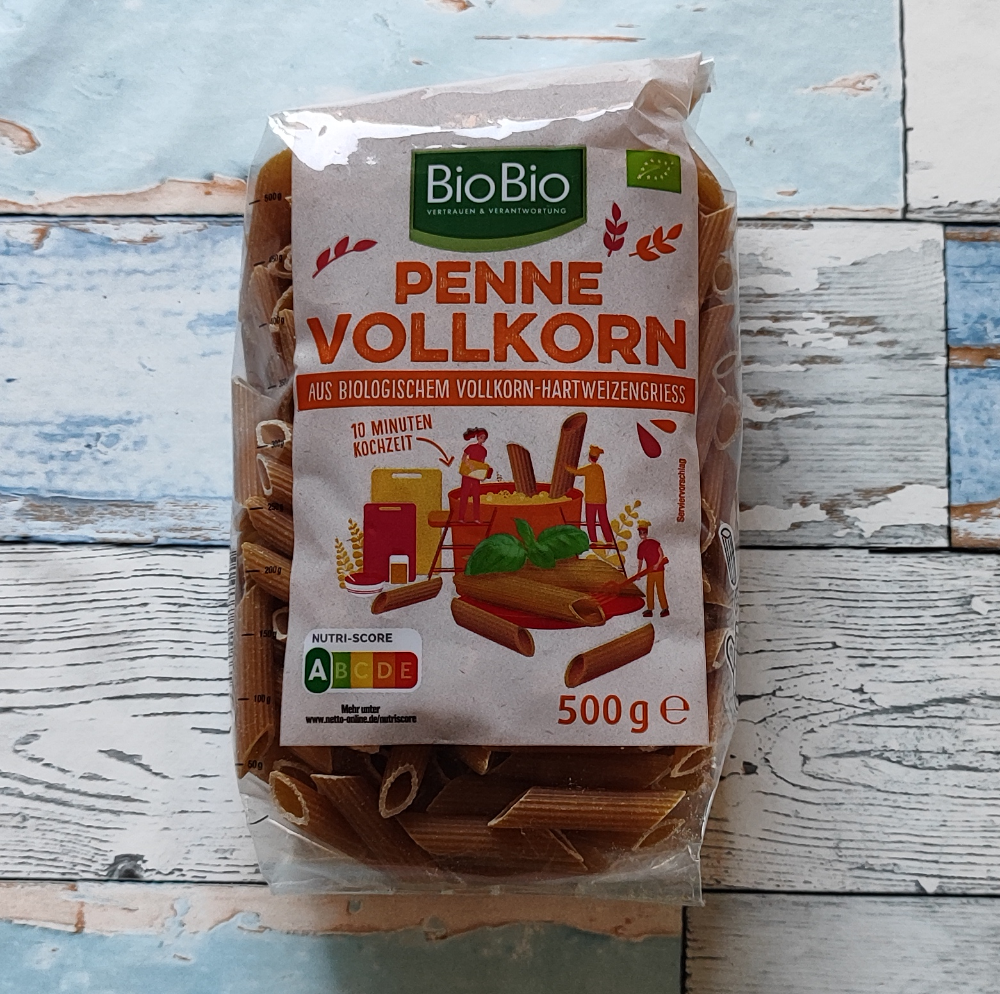

# Zutaten
#### Ich wohne auf dem Land und fahre einmal in der Woche zum Einkaufen. Ein NETTO und ein EDEKA Markt sind für mich am besten zu erreichen.
Deshalb verwende ich vor allem Zutaten, die es dort gibt.
Wer anders einkauft: Ähnliche Produkte gibt es in gut sortierten Supermärkten, beim Discounter, eventuell auf dem Wochenmarkt oder im Bio-Laden.

## Die Nudeln

<table>
  <tr>
    <td>Vollkornpenne</td>
    <td></td>
    <td>Netto</td>
    <td>ca. 1,50 € je 500 g Packung</td>
  </tr>
</table>
