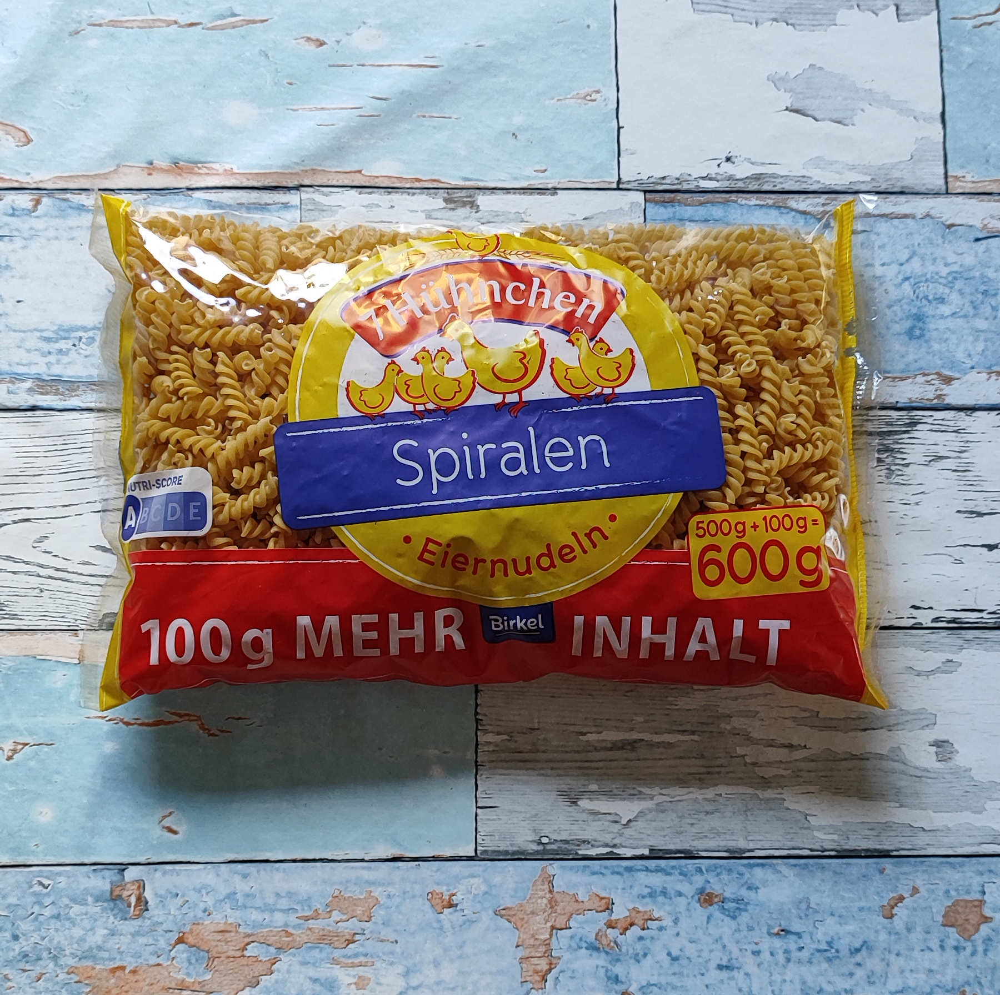
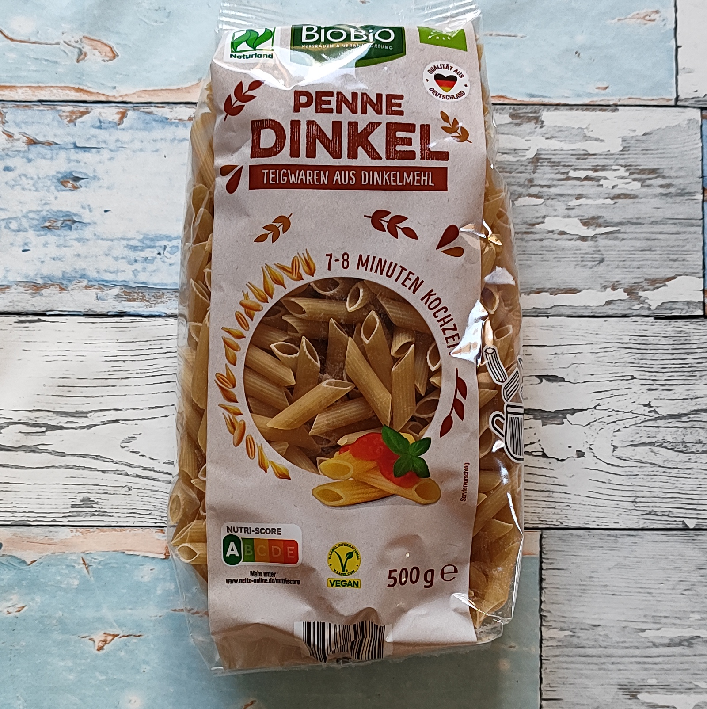
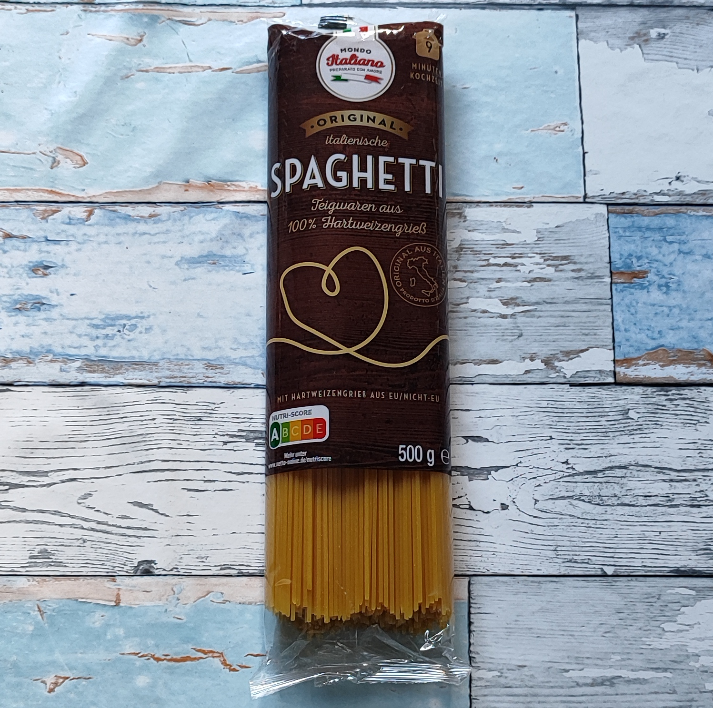
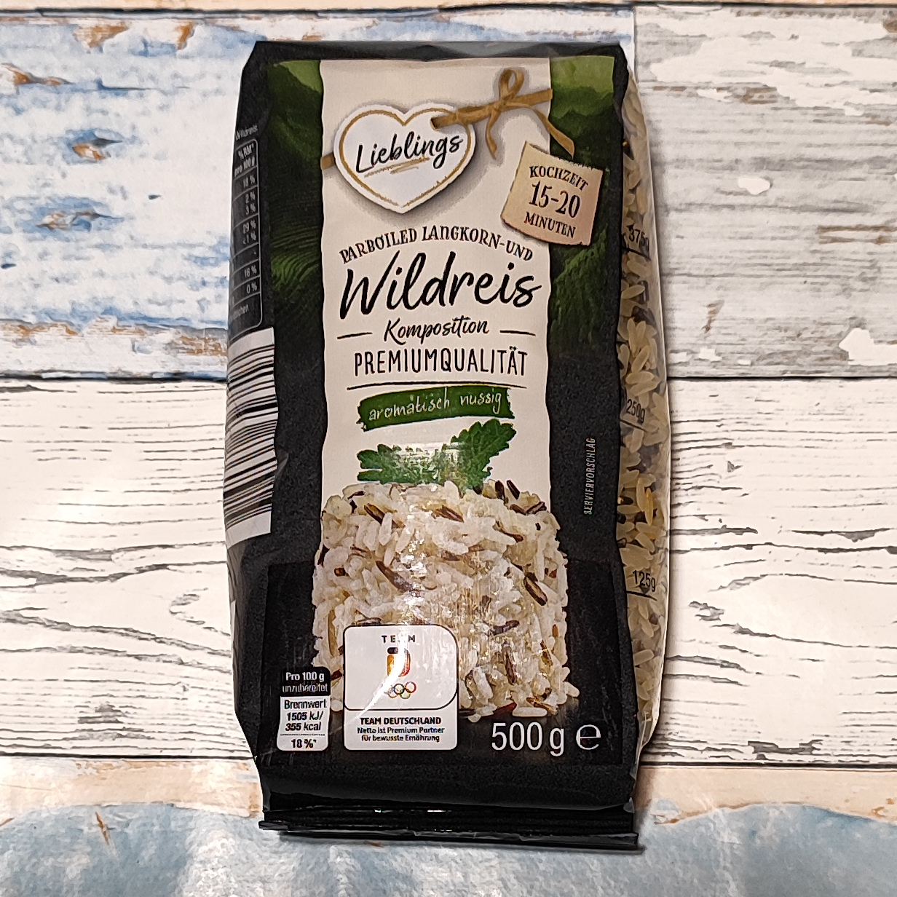
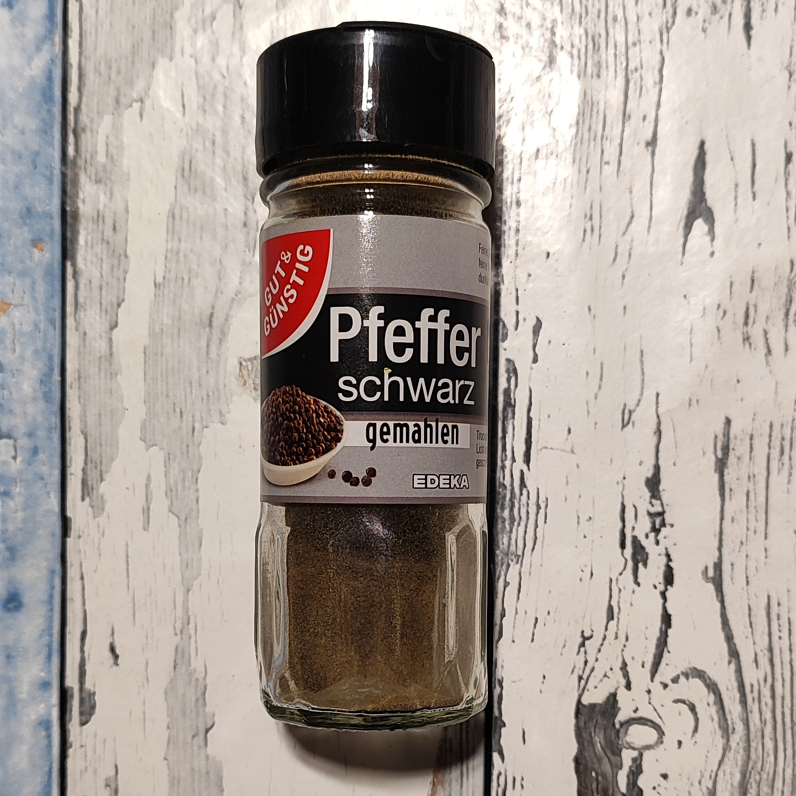
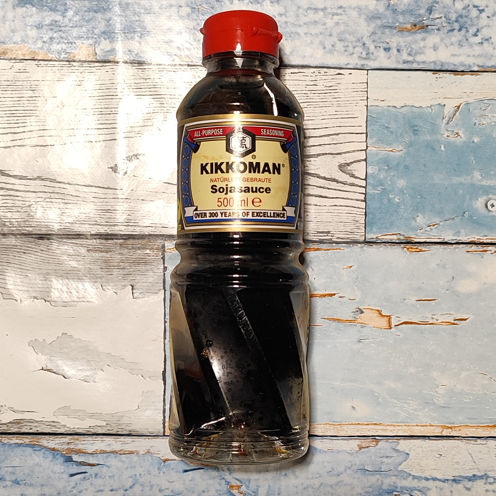

# Zutaten
Ich wohne auf dem Land und fahre einmal in der Woche zum Einkaufen. Ein NETTO und ein EDEKA Markt sind für mich am besten zu erreichen.
Deshalb verwende ich vor allem Zutaten, die es dort gibt. 
Wer anders einkauft: Ähnliche Produkte gibt es in gut sortierten Supermärkten, beim Discounter, eventuell auf dem Wochenmarkt oder im Bio-Laden. 
*Aber - diese Zutatenliste ist entstanden, weil ich nach Probieren von Vergleichsprodukten genau bei diesen Produkten geblieben bin.*

## Die Nudeln / Der Reis

<table>
  <tr>
    <th><h3>Produkt</h3></th>
    <th><h3>Produktfoto</h3></th>
    <th><h3>Markt</h3></th>
    <th><h3>Ungefährer Preis</h3></th>
    <th><h3>Sensorische Beschreibung</h3></th>
  </tr>
  <tr>
    <td><h4>Vollkorn Penne</h4></td>
    <td style="text-align:center"></td>
    <td>Netto</td>
    <td>ca. 0,75 € je 500 g Packung</td>
    <td>milder Geschmack nur geringe 'sandig/krümelige' Textur</td>
  </tr>
  <tr>
    <td><h4>Spiralnuden</h4></td>
    <td style="text-align:center"></td>
    <td>Edeka/Netto oder andere</td>
    <td>ca. 1,90 € je 600 g Packung</td>
    <td>zurückhaltender Biss nehmen die Soße/den Sud geschmacklich auf</td>
  </tr>
  <tr>
    <td><h4>Dinkel Penne</h4></td>
    <td style="text-align:center"></td>
    <td>Netto</td>
    <td>ca. 1,60 € je 500 g Packung</td>
    <td>erkennbarer Biss setzen einen leichten, eigenen Geschmacksakzent</td>
  </tr>
  <tr>
    <td><h4>Spaghetti</h4></td>
    <td style="text-align:center"></td>
    <td>Netto</td>
    <td>ca. 0,70 € je 500 g Packung</td>
    <td>leckerer Biss auf der Gabel lassen sich gut 'al dente' kochen</td>
  </tr>
  <tr>
    <td><h4>Reis mit Wildreis</h4></td>
    <td style="text-align:center"></td>
    <td>Netto</td>
    <td>ca. 2,00 € je 500 g Packung</td>
    <td>guter Geschmack passend zu meiner Zubereitungsmethode</td>
  </tr>
</table>

## Die Gewürze

<table>
  <tr>
    <th><h3>Produkt</h3></th>
    <th><h3>Produktfoto</h3></th>
    <th><h3>Markt</h3></th>
    <th><h3>Ungefährer Preis</h3></th>
    <th><h3>Sensorische Beschreibung</h3></th>
  </tr>
  <tr>
    <td><h4>Schwarzer Pfeffer</h4></td>
    <td style="text-align:center"></td>
    <td>Edeka GUT & GÜNSTIG</td>
    <td>ca. 0,85 € je 50 g Streuer</td>
    <td>moderate Schärfe intensives Aroma</td>
  </tr>
  <tr>
    <td><h4>Sojasauce</h4></td>
    <td style="text-align:center"></td>
    <td>Edeka/Netto oder andere</td>
    <td>ca. 5,00 € für die 500 ml Flasche</td>
    <td>ausgewogener Geschmack kräftige Würzung</td>
  </tr>
</table>

*Hinweis: Markennennungen sind Beispiele aus meinem eigenen Einkauf, keine Werbung.*

---
[← Zurück zur Übersicht](index.md)

